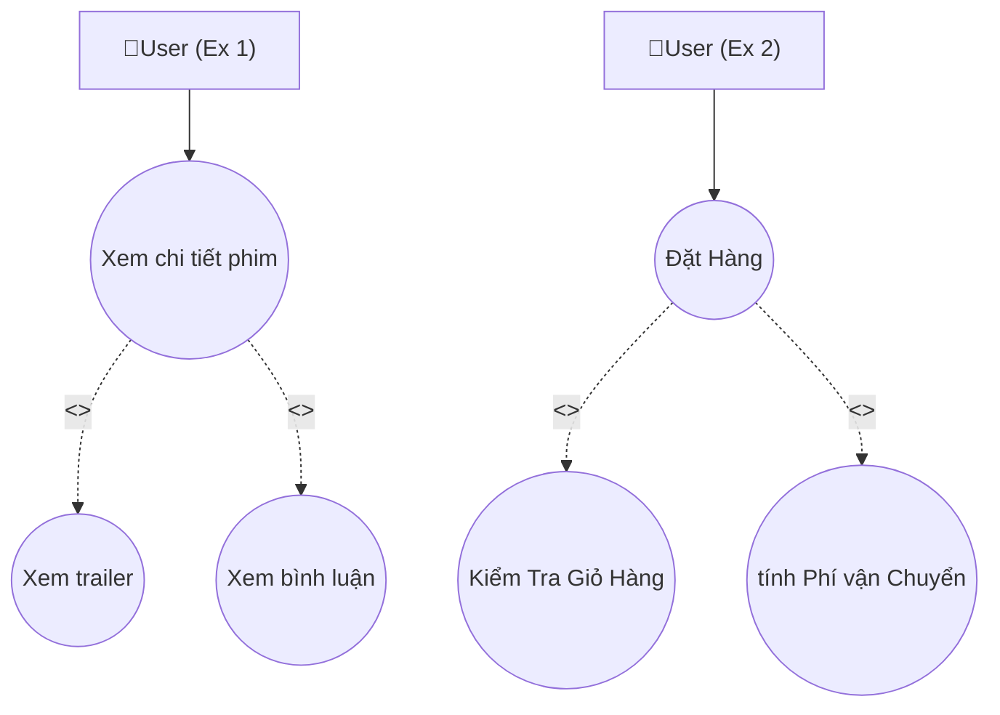
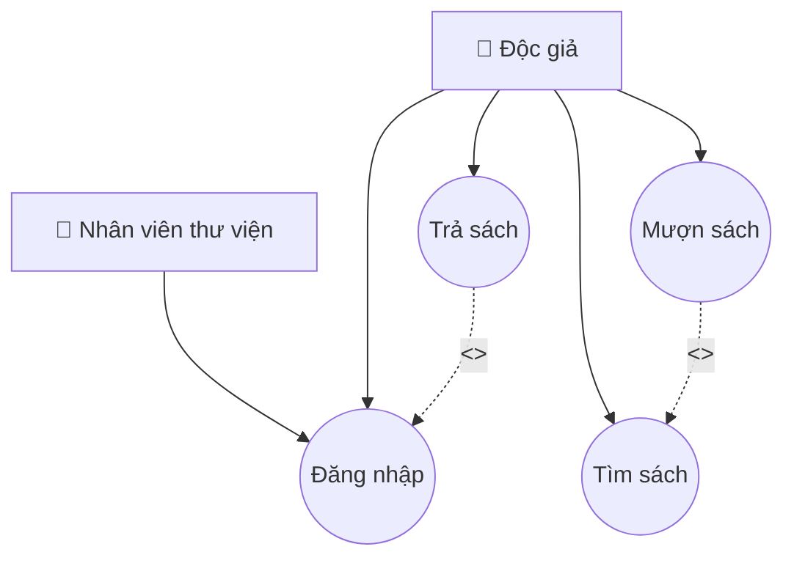

## Session 03: Use Case Diagram minh hoạ

<h1>Ex 1 + 2</h1>
Mô tả:<br>
- << include >> Quan hệ bao hàm, chỉ ra rằng Use Case chính gọi đến phụ <br>
Use Case chính là "xem chi tiết phim" và "đặt hàng" của 2 use case dưới<br>
Khi user chọn Case chính thì có thể thực hiện thêm các bước ở case phụ
  



<h1>Ex 3: Xác định mối quan hệ giữa các Use Case (association, include hay extend)</h1>
<ul>
   <li>inlcude : Nghĩa là chức năng phụ bắt buộc được thực hiện mỗi khi chức năng chính chạy.</li>
   <li>Association:  User có liên kết trực tiếp (association) với chức năng chính</li>
   <li>extend: Nghĩa là chức năng phụ không bắt buộc, chỉ mở rộng hành vi chính.</li>
</ul>
<table>
  <tr>
     <th>Use Case A</th>
     <th>Use Case B</th>
     <th>Mối quan hệ</th>
     <th>Giải thích</th>
  </tr>
  <tr>
    <td>Đặt Hàng</td>
    <td>Kiểm tra giỏ hàng</td>
    <td>include</td>
    <td>Vì trước khi đặt hàng, user phải kiểm tra giỏ hàng ( xem số lượng, chẹc lại đơn ) do đó KT giỏ hàng là bước bắt buộc bao hàm trong đặt hàng</td>
  </tr>
  <tr>
    <td>Đặt Hàng</td>
    <td>Đề xuất Hoá đơn</td>
    <td>inlcude</td>
    <td>Sau khi đặt hàng hệ thống luôn tạo/ đề xuất hoá đơn, để user xác nhận thanh toán, và đây là hành vi luôn xảy ra khi đặt hàng</td>
  </tr>
   <tr>
    <td>Đặt hàng</td>
    <td>Xem đánh giá</td>
    <td>extend</td>
    <td>Bởi vì đây là hành vi mở rộng, ko bắt buộc, người dùng có thêm trước và sau khi đặt hàng</td>
  </tr>
   <tr>
    <td>Kiểm tra giỏ hàng</td>
    <td>User</td>
    <td>asociation</td>
    <td>User có thể truy cập trực tiếp vào giỏ hàng bất cứ lúc nào, mối quan hệ giữa Actor và Use Case</td>
  </tr>
   <tr>
    <td>Đặt Hàng</td>
    <td>User</td>
    <td>asociation</td>
    <td>User thực hiện hành vi đặt hàng, mối quan hệ giữa Actor và Use Case</td>
  </tr>
   <tr>
    <td>Xem Đánh giá</td>
    <td>User</td>
    <td>asociation</td>
    <td>User thực hiện hành vi Xem, mối quan hệ giữa Actor và Use Case</td>
  </tr>
</table>


<h1>Ex 4: Vẽ Use Case Diagram Hệ thống quản lý thư viện</h1>




<h1>Ex 5: Phân loại Actor theo vai trò (primary, secondary) </h1>
<p>Mô tả: Cho tình huống: Xây dựng app giao đồ ăn online</p>
<table>
  <tr>
     <th>Actor</th>
     <th>Loại</th>
     <th>User Case</th>
  </tr>
  <tr>
    <td>Cusomter</td>
    <td>Primary</td>
    <td>Tương tác: đặt hàng, xem đánh giá, tìm món, thanh toán đơn hàng ... </td>
  </tr>
   <tr>
    <td>Driver</td>
    <td>Secondary</td>
    <td>Nhận đơn, giao hàng, hoành thành, xem đánh giá dịch vụ</td>
  </tr>
   <tr>
    <td>Saller</td>
    <td>Primary</td>
    <td>nhận đợn từ khách hàng, xác nhận, hoành thành, xem đánh giá dịch vụ</td>
  </tr>
   <tr>
    <td>Admin</td>
    <td>Secondary</td>
    <td>Quản lý người dùng: tài xế, khách hàng, chủ cửa hàng, xem thống kê doanh thu ...</td>
  </tr>
</table>


<h1>Ex 6: Diễn đạt Use Case Description đầy đủ Đặt hàng </h1>
  <ul>
    <li><strong>Tên: </strong>Đặt Hàng</li>
    <li><strong>Actor: </strong>Khách Hàng</li>
    <li><strong>Mục Tiêu: </strong>Khác Hàng thực hiện chọn món xác nhận thông tin để hê thông ghi nhận dữ liệu và xác nhận đặt hàng</li>
    <li><strong>Luồng Chính: </strong>Khách hàng -> đăng nhập -> tìm kiếm & chọn món -> mở giỏ hàng -> tiến hành đặt hàng -> hệ thống xác nhận & tạo đơn -> hiện thị thông báo đặt hàng thành công</li>
    <li><strong>Luồng Lỗi: </strong>Hệ thống thông báo chưa chọn món, Y/c Nhập đầy đủ thông tin ( STĐ ,đia chỉ, ...), Thanh toán thất bại, cưa hàng đóng cửa || dừng hoạt động, lỗi hệ thống ..</li>
    
  </ul>


<h1>Ex 7: Vẽ sơ đồ Use Case có include, extend, ghi rõ Actor - Use Case </h1>


```mermaid
flowchart TD
    %% === ACTORS ===
    A1[👤 Khách Hàng]
    A2[👤 Tài Xế]
    A3[👤 Hê thống thanh Toán]


   %% === Use Case === Đặt xe, Xem vị trí tài xế, Thanh toán, Nhận khuyến mãi
   B1((Đặt xe))
   B2((Xem vị trí tài xế))
   B3((Thanh Toán))
   B4((Nhận Khuyến mãi))
     
  
   %% === Relations ===
    A1 --> B1
    A1 --> B4
    B1 -.-> |<<include>>| B2
    B1 -.-> |<<include>>| B3
    A3 --> B3
    A2 --> B2
   


