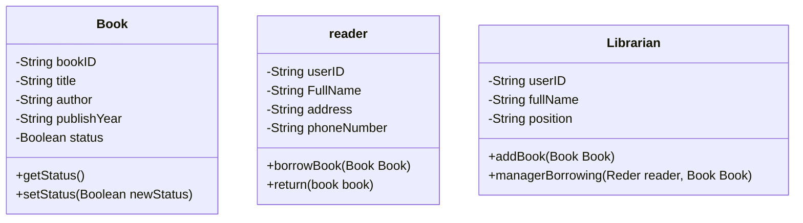
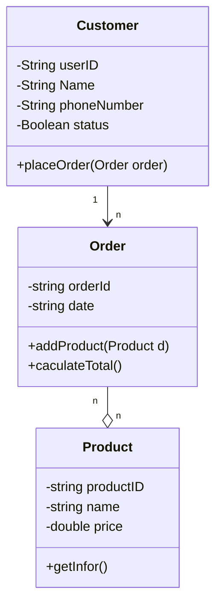
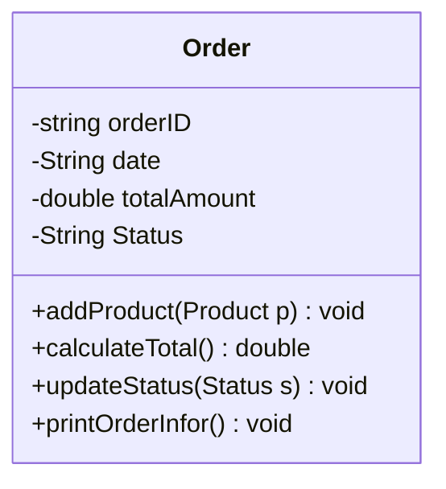
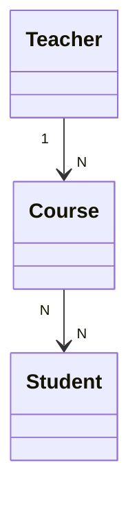
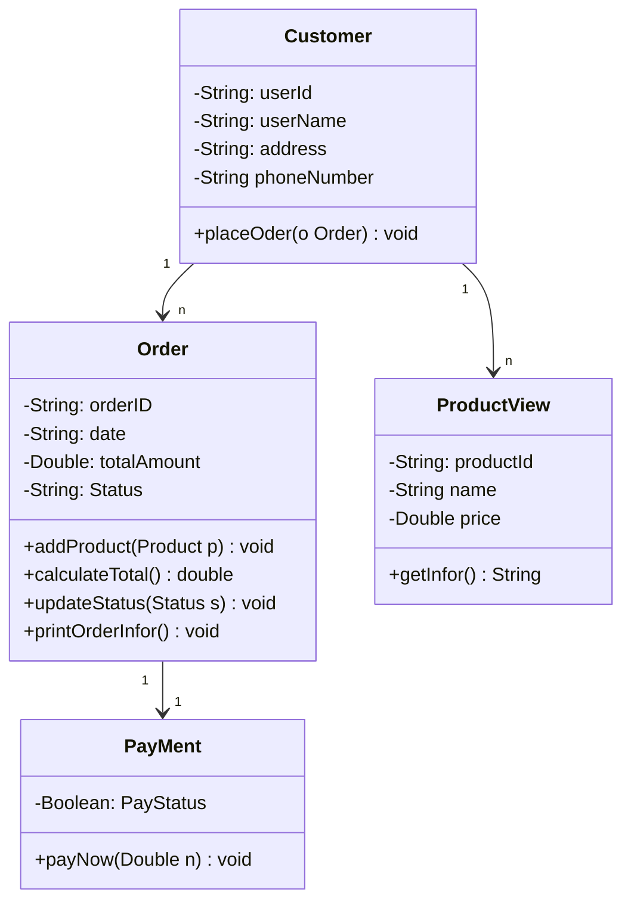
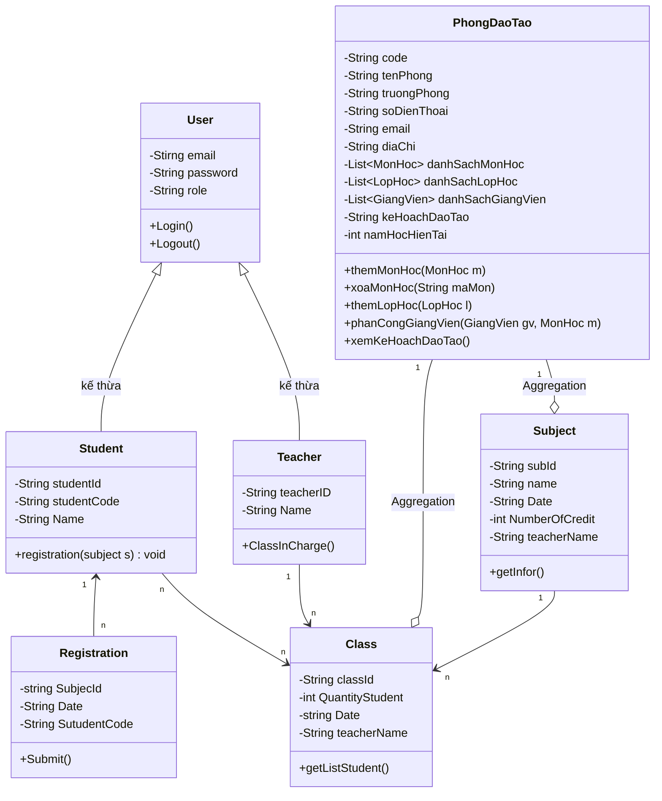
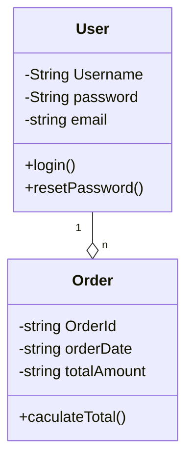
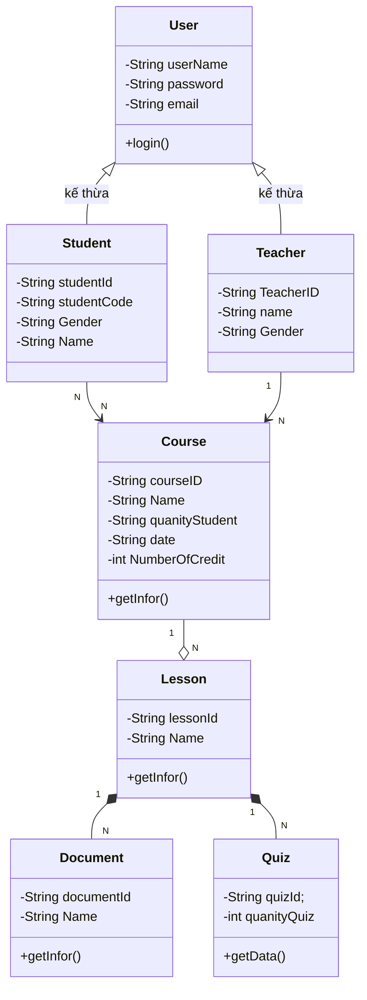

<h1>Ex 1: Xác định danh sách các lớp phù hợp</h1>
    <h3>1. Book</h3>
        - Vài trò: Lớp thực thể chính  
        - Đại diện cho thông tin của từng quyển sách
    <h3>2. Reader</h3>
        -Vai trò: Lớp thực thể, mô tả người dùng hệ thống  
        -Lưu Chữ thông tin về độc giả - những người có liên quan mượn và trả sách
    <h3>3. Librarian</h3>
        -Vai Trò: Lớp điều hành/ Quạn trị hệ thống  
        -Quản lý sách và hỗ trợ độc giả ( mượn, trả sách )

<h1>Ex 2: Nhận diện loại quan hệ và giải thích.</h1>
<table>
    <tr>
         <th>Mối Quan Hệ</th>
         <th>Loại Quan Hệ</th>
         <th>Giải thích</th>
         <th>Ký hiệu UML</th>
    </tr>
    <tr>
         <td>Một Giáo Viên Giảng Dạy nhiều lớp học</td>
         <td>Association</td>
         <td>Giáo Viên vào lớp học có mối quan hệ logic với nhau: Một Giáo viên có thẻ dạy nhiều lớp, và một lớp có thể có nhiều giáo viên</td>
         <td>Đường nối Đơn </td>
    </tr>
    <tr>
         <td>Một Đơn hàng gồm nhiều sp</td>
         <td>Aggregation</td>
         <td>Đơn hàng chứa nhiều sp, nhưng sp vẫn tồn tại đôc lập, nếu đơn hàng bị xoá, đây là mối quan hệ có nhưng ko phụ thuộc</td>
         <td>Đường nối có hình kim cương rỗng ở phía đơn hàng</td>
    </tr>
    <tr>
        <td>Một cơ thể gồm nhiều bộ phận không thể tách rời</td>
         <td>Composition</td>
         <td>các bộ phận là thành phân bắt buộc của cơ thể. Nếu cơ thể không tồn tại, thì các bộ phận cx ko tồn tại, không thể hoạt động độc lập</td>
         <td>Đường nối có hình kim cương đặc ở phía cơ thể</td>
    </tr>
</table>

<h1>Ex 3: Áp dụng các phạm vi truy cập truy cập (public, private, protected)</h1>

<table>
    <tr>
        <th>Thành Phần</th>
        <th>Modifier</th>
        <th>Giải Thích</th>
    </tr>
    <tr>
        <td>UserName</td>
        <td>Private</td>
        <td>Vì UserName Là thông tin người dùng, => được bảo mật</td>
    </tr>
    <tr>
         <td>PassWord</td>
         <td>Private</td>
         <td>Vì PassWord cùng là thông tin người dùng cần đc bảo mật</td>
    </tr>
     <tr>
         <td>Login</td>
         <td>Public</td>
         <td>Vì Login là hành động truy cập từ bên ngoài => công khai các lơp để gọi và đăng nhập</td>
    </tr>
     <tr>
         <td>resetPassword</td>
         <td>Public</td>
         <td>Là hành động công khai, Người dùng có thể gọi để đôi mk khi cần</td>
    </tr>
     <tr>
         <td>lastLoginTime</td>
         <td>Protected</td>
         <td>thông tin đăng nhập cuối cùng, để kiểm tra hoạt động người dùng, => Không lên công khai cho lớp khác</td>
    </tr>
</table>

<h1>Ex 4:Diễn tả sơ đồ Class gồm 2–3 lớp có quan hệ đơn giản </h1>

<h1>Ex 5:Trình bày danh sách thuộc tính và phương thức dưới dạng bảng hoặc mô hình UML đơn giản </h1>

<h1>Ex 6: Biểu diễn quan hệ 1–1, 1–N, N–N đúng cú pháp UML.</h1> 

<h1>Ex 7: </h1>

<h1>Ex 8: Thiết kế mô hình lớp cho hệ thống đăng ký học phần</h1>

<h1>Ex 9: Vẽ lại sơ đồ Class cải tiến</h1>

<h3>Giải thích</h3>
<ul>
    <li>Lỗi quan hệ giữa các lớp ( có thể ): Nếu chỉ mô tả User có thể đặt hàng, thì ( không cần quản lý vòng đợi thì có thể dùng Association ) nếu muốn quản lý vòng đời oder để thông kê, order tồn tại riêng biệt thì dùng Aggregation</li>
    <li>Lỗi multiplicity: Vì Một User có thể, có nhiều order => 1 -> "n" order</li>
    <li>Lỗi modifier: các thuộc tích bên trong class user, order cần được để private, vì đó là thông tin ca nhân của 1 user "-"</li>
</ul>

<h1>Ex 10: thiết kế Class Diagram cho hệ thống E-learning</h1>

