<h1>Ex 1: Liệt kê và mô tả vai trò từng thành phần</h1>

<table>
    <tr>
        <th>Thành Phân</th>
        <th>Tên</th>
        <th>Vai Trò/Chức năng</th>
        <th>Kí hiệu</th>
    </tr>
    <tr>
         <td>Actor</td>
         <td>Khách Hàng</td>
         <td>Là người bên ngooài hệ thống, Khởi tạo và tương tác. Gửi Y/c "đăng Nhập", "thanh toán", "đặt hàng"</td>
         <td>Đc biểu diễn bởi hình người que</td>
    </tr>
    <tr>
         <td>Object</td>
         <td>Website</td>
         <td>Là thành phần nội bộ hệ thống, chịu trách nhiệm xử lý yêu cầu từ actor. Nhận Y/c hiện thị giao diện, gửi dữ liệu đến hệ thống</td>
         <td>Biểu diễn bằng hình chữ nhât</td>
    </tr>
    <tr>
         <td>Object</td>
         <td>Hệ thống thanh toán</td>
         <td>Là thành phần tham gia xử lý nghiệp vụ, thực hiện xác minh và phản hồi Kết quả thanh toán/td>
         <td></td>
    </tr>
    <tr>
         <td>LifeLine</td>
         <td>lifeline của từng Actor, Object</td>
         <td>Thể hiện thời gian tồn tại và tương tác của mỗi thành phần trong quá tình thực thi mỗi Message đc vẽ giữa các lifeline</td>
         <td>là đường thẳng dọc xuống dưới, kéo dài suất, TG, diễn ra tương tác</td>
    </tr>
</table>

<h1>Ex: 2 Nhận diện các loại thông điệp: synchronous, asynchronous, return.</h1>

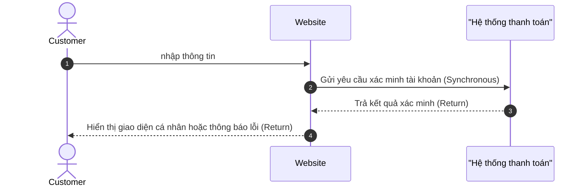

<h1>Ex 3: Hệ thống kiểm tra điều kiện. Nếu hợp lệ, ghi nhận đăng ký</h1>

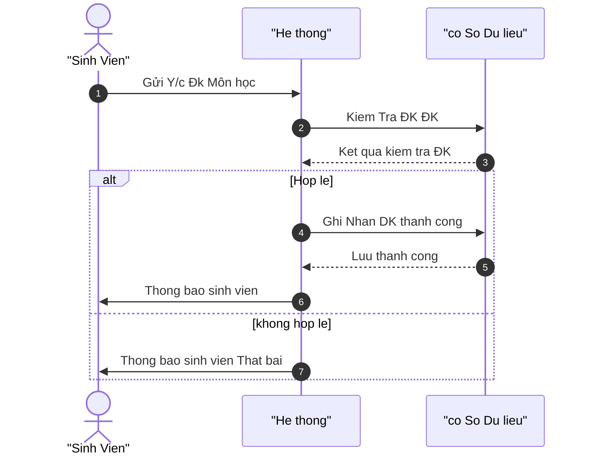

<h1>Ex 4: Người dùng thêm nhiều sản phẩm vào giỏ hàng</h1>

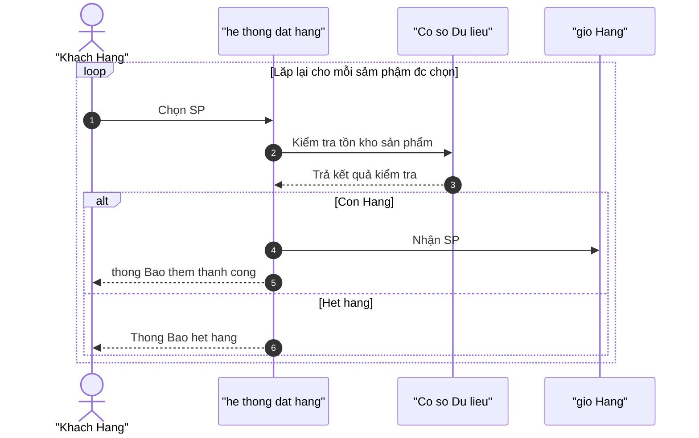

<h1>Ex 5: Dùng cấu trúc điều kiện trong Sequence.</h1>

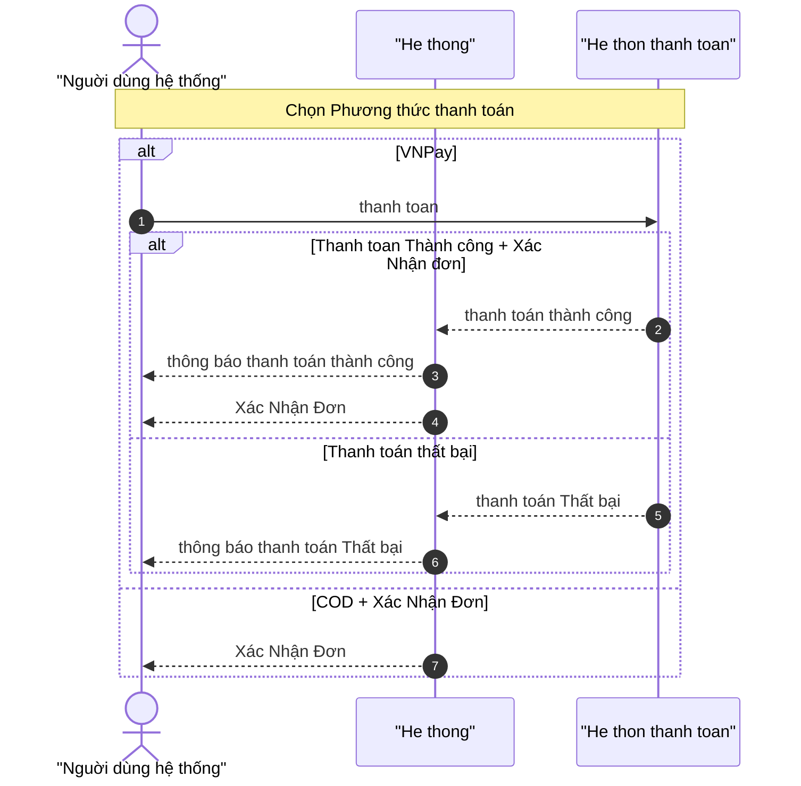

<h1>Ex 6: phân tích: Tài khoản người dùng.</h1>

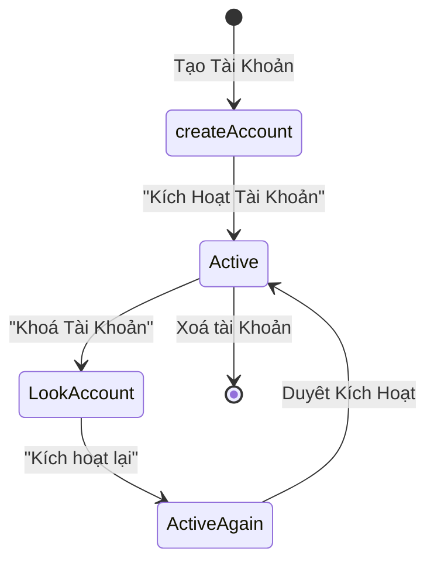

<h1>Ex 7: phân tích:Đơn hàng online.</h1>

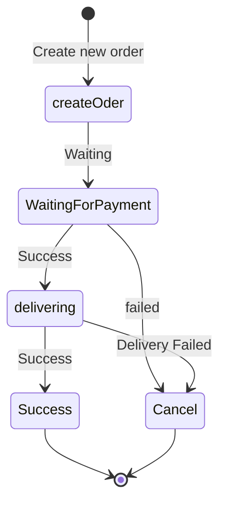

<h1>Ex 8: phân tích: Sản phẩm</h1>

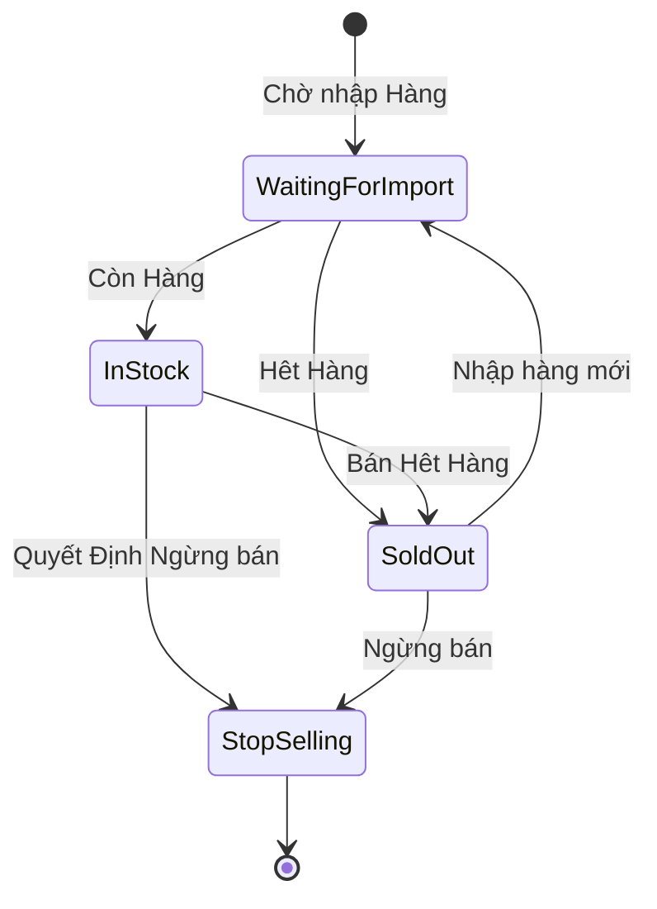

<h1>Ex 9: phân tích: Tài khoản người dùng.</h1>

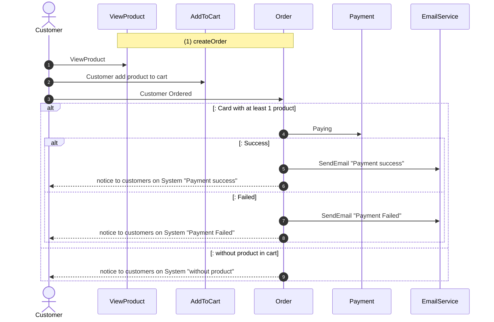

<h1>Ex 10: phân tích: Hệ thống nộp bài tập.</h1>

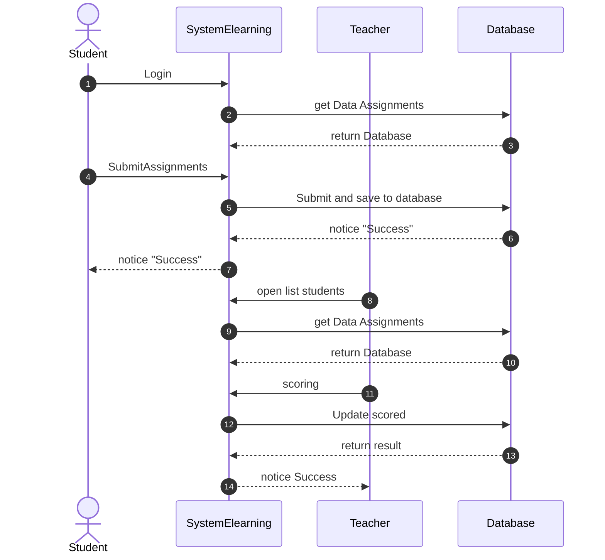

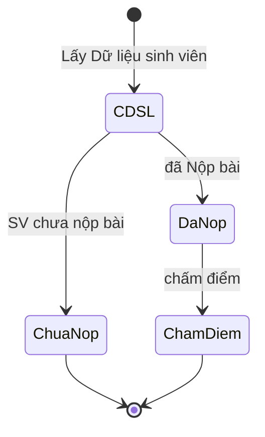

<h3>Logic tổng thể</h3>
<ul>
    <li>1. Hệ thống lấy thông tin bài tập từ CSDL hiện thị cho SV<</li>
    <li>2. Sinh viên có thể chọn bài tập và nộp bài và lưu và CSDL</li>
    <li>3. Giảng viên đăng nhập vào hệ thông, có thể xem bài tập và chấm điểm, hệ thông cập nhập và lưu điển</li>
</ul>

<h3> Mapping giữa Sequence Diagram và State Diagram </h3>
<table>
  <tr>
    <th>Sequence Step</th>
    <th>Sự kiện (Trigger)</th>
    <th>Trạng thái bị ảnh hưởng trong State Diagram</th>
  </tr>
  <tr>
    <td>(1–4) Sinh viên mở giao diện nộp</td>
    <td>Hiển thị bài tập</td>
    <td>Bắt đầu ở Chưa nộp (ChuaNop)</td>
  </tr>
  <tr>
    <td>(5–8) Sinh viên tải bài lên và lưu thành công</td>
    <td>Upload thành công</td>
    <td>Chuyển sang Đã nộp (DaNop)</td>
  </tr>
  <tr>
    <td>(9–12) Giảng viên mở và chấm bài</td>
    <td>Bắt đầu chấm</td>
    <td>Trạng thái Đã nộp → Chấm điểm (ChamDiem)</td>
  </tr>
  <tr>
    <td>Sau khi chấm xong</td>
    <td>Lưu điểm</td>
    <td>Chấm điểm → Đã chấm (DaCham)</td>
  </tr>
  <tr>
    <td>Kết thúc quy trình</td>
    <td>Hoàn tất</td>
    <td>Trạng thái cuối cùng [ * ]</td>
  </tr>
</table>

<h1>Ex: BTTH Phân Tích Hành Vi với Sequence & State Diagram </h1>

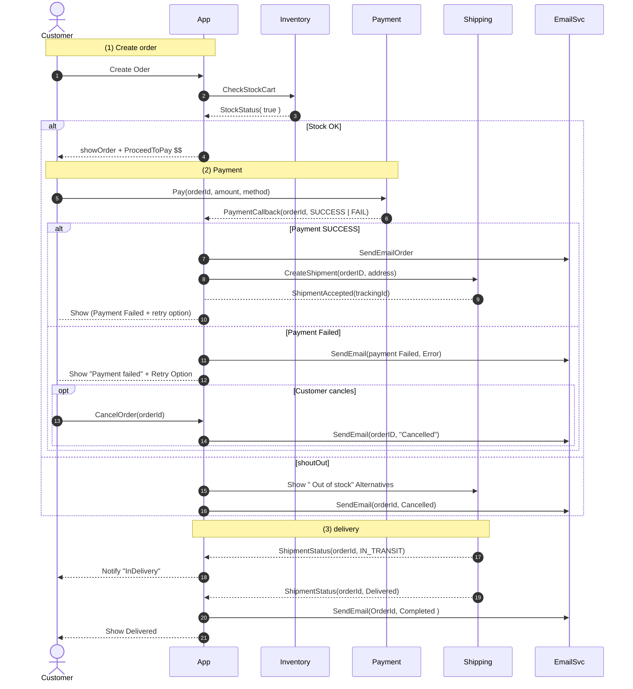
