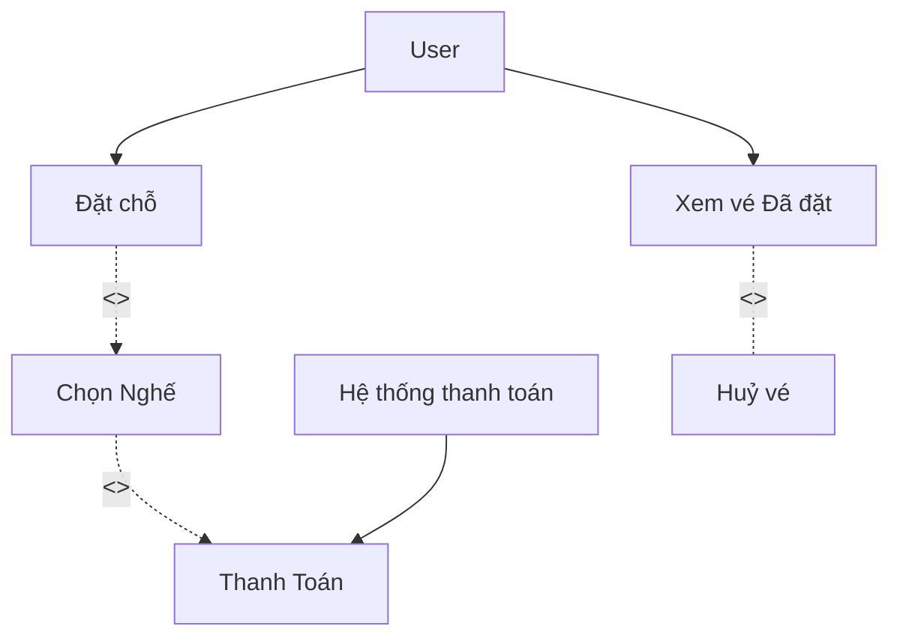
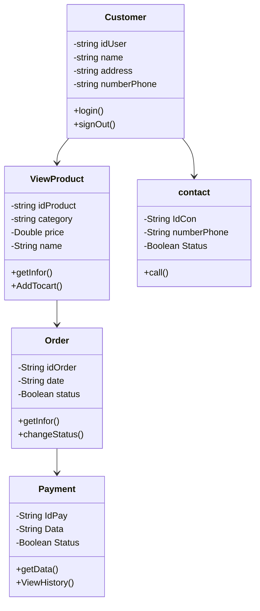
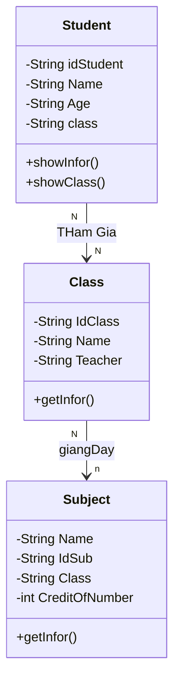
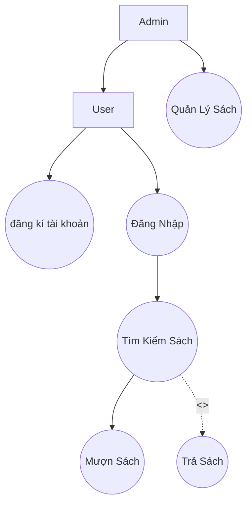
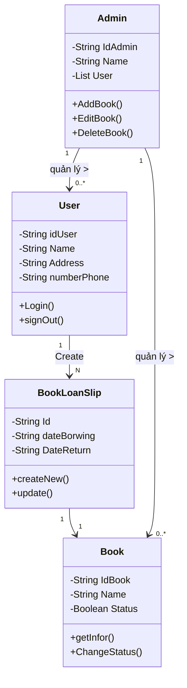
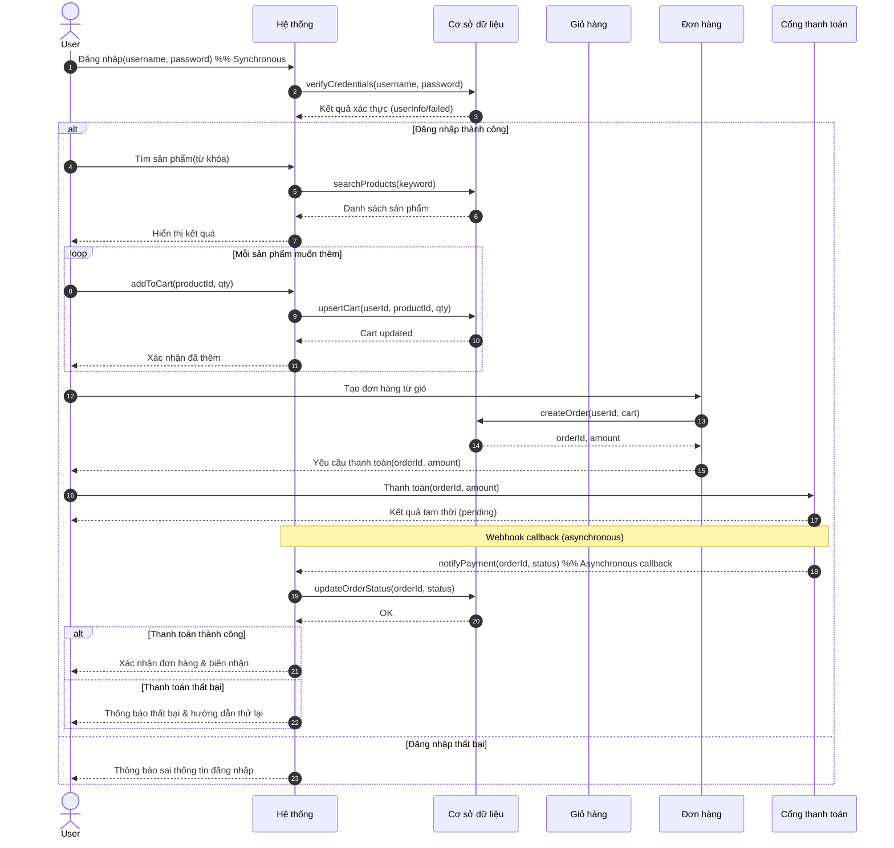
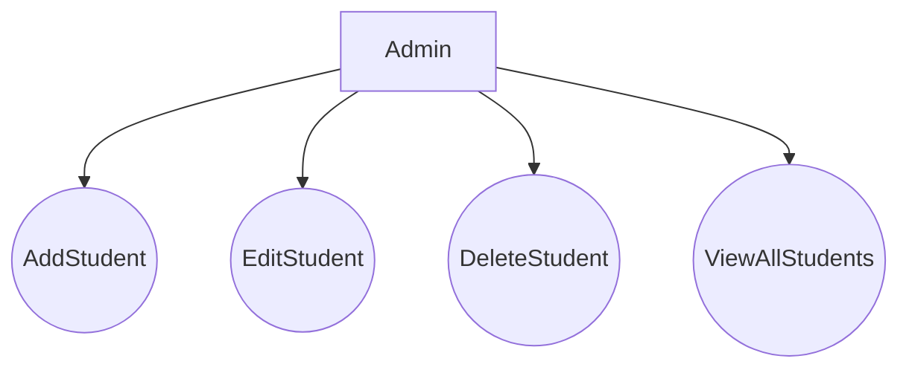
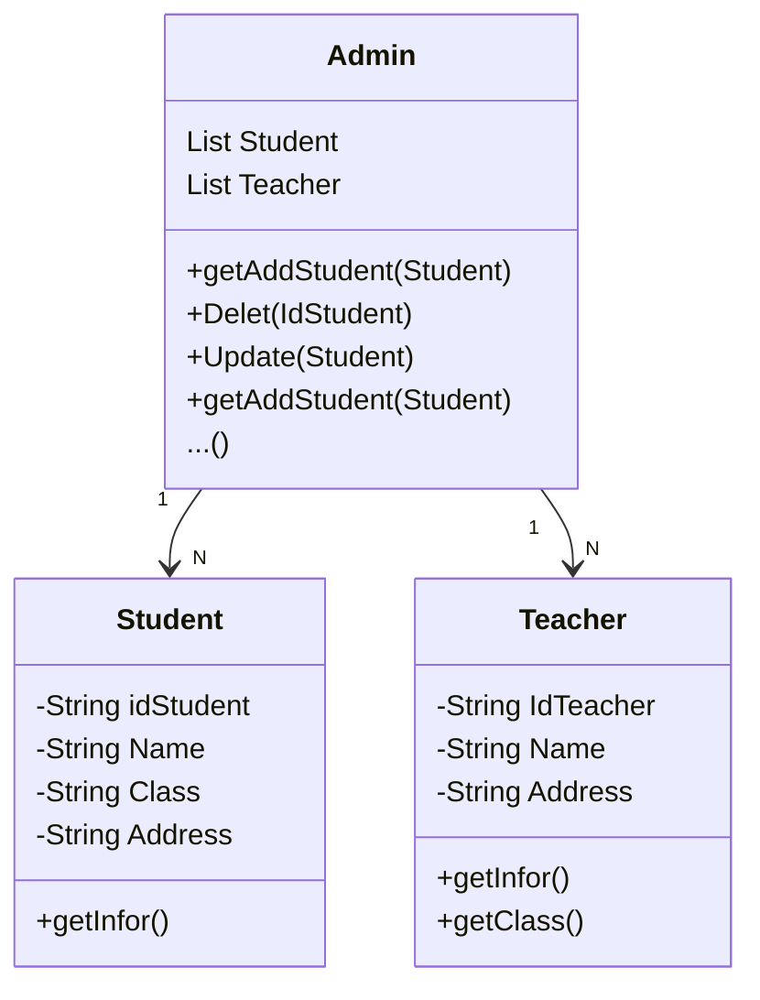
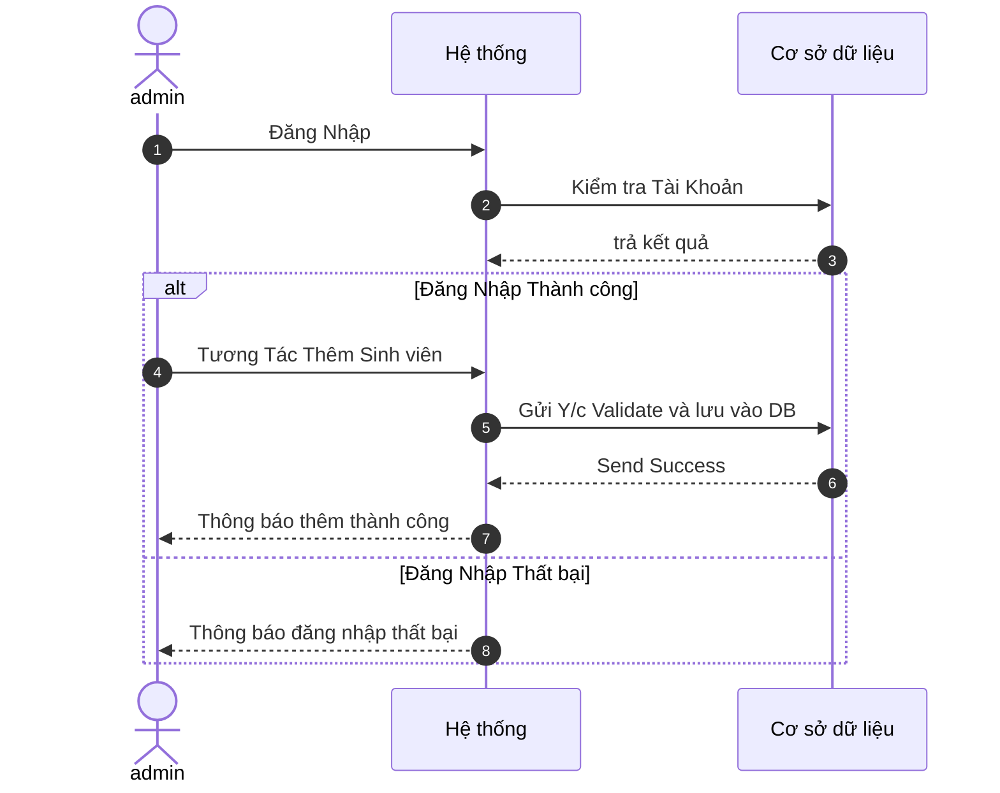

<h1>Ex 1: Chức năng mô tả nghiệp vụ: Hệ thống đặt vé xem phim online.</h1>

<h1>Ex2: Vẽ sơ đồ lớp (Class Diagram) </h1>

<h1>Ex 3: Chức năng mô tả nghiệp vụ: Hệ thống bán khóa học trực tuyến (E-learning).</h1>
<table>
    <tr>
        <th>Stakeholder</th>
        <th>Role</th>
        <th>Nguồn Y/c</th>
    </tr>
    <tr>
         <td>Student</td>
         <td>Người sử dụng chính, tham gia các khoá học, làm bài tập, và xem video bài giảng</td>
         <td>Mong muốn học tập trực tuyến, truy cập linh hoạt</td>
    </tr>
    <tr>
         <td>Giảng viên</td>
         <td>Có Trách nghiêm, nghiên cứu thêm sửa các bài giảng, video, bài kiểm tra đánh giá học viên, chấm điểm</td>
         <td>Cần công cụ dễ dùng, thao tác nhanh ngọn, quản lý nội dung và chấm diểm</td>
    </tr>
    <tr>
         <td>Admin</td>
         <td>Quản lý người dùng, khoá học, sử lý báo cáo và đảm bảo an toàn dữ liệu</td>
         <td>Cần hệ thống ổn định, bảo mật dễ bảo trì</td>
    </tr>
    <tr>
         <td>Bộ phận IT</td>
         <td>Giám sát hoạt động hệ thống, tài nguyên hệ thống, Sử lý lỗi kĩ thuật</td>
         <td>Cân khả năng theo dõi, log và phục hồi nhanh khi có sư cố</td>
    </tr>
</table>

<h3> Y/c Chứng năng (function requirement )</h3>
<table>
    <tr>
        <th>Y/c Chứng năng</th>
        <th>Mô tả</th>
    </tr>
    <tr>
        <td>Đăng Kí / nhập</td>
        <td>Hệ thống cho phép người dùng đăng kí và nhập để truy cập khoá học</td>
    </tr>
    <tr>
        <td>Tìm kiếm thông tin khoá học</td>
        <td>Người dùng có thể tìm kiếm được theo tên, chủ dề</td>
    </tr>
    <tr>
        <td>Đăng Kí khoá học</td>
        <td>cho phép người dùng có thẻ dăng kí khoá học phù hợp</td>
    </tr>
    <tr>
        <td>Làm bài kiểm tra Quiz</td>
        <td>Học viên có thể thực hiện bài kiểm tra trắc nghiệm</td>
    </tr>
    <tr>
        <td>theo dõi tiến trình học tập</td>
        <td>Học viên có thể xem phần trăm hoàn thanh khoá học</td>
    </tr>
    <tr>
        <td>Hệ thông thông báo</td>
        <td>Gửi thông báo khi có bài Ktra, sư kiện ..</td>
    </tr>
</table>

<h3> Y/c ko Chứng năng (non-function requirement )</h3>
<table>
    <tr>
         <th>Y/c Chứng năng</th>
        <th>Mô tả</th>
    </tr>
    <tr>
        <td>Hiệu suất</td>
        <td>Hệ thống phải hỗ trợ đc nhiều người dùng đăng nhập cùng lúc</td>
    </tr>
    <tr>
        <td>Bảo mật</td>
        <td>Mọi thông tin người dùng đều đc mã hoá</td>
    </tr>
    <tr>
        <td>Khả năng mở rộng</td>
        <td>Cho phép mở rộng sever khi lượng lớn học viên</td>
    </tr>
    <tr>
        <td>Khả năng Bảo trì</td>
        <td>Mã nguồn đc tổ chức module hoá, dễ nâng cấp, và sủa lỗi</td>
    </tr>
</table>

<h1>Ex 4: Nhận biết các loại hệ thống thông tin và mô hình phát triển phù hợp.</h1>

<table>
    <tr>
        <th>Loại hệ thống</th>
        <th>Vai trò hệ thống</th>
        <th>Giải Thích</th>
    </tr>
    <tr>
        <td>TPS(Transaction Processing System)</td>
        <td>Cối lõi của hệ thống</td>
        <td>Ghi nhập các xử lý giao dịch như tạo đơn, cập nhập trạng thái, xác nhận Giao Hàng</td>
    </tr>
    <tr>
        <td>MIS(Management Information System)</td>
        <td>Phân tích và báo cáo</td>
        <td>Cung cấp các báo cáo tổng hợp về số lượng đơn, hiệu suất nhân viên giao hàng, tỉ lệ giao hàng thành công..</td>
    </tr>
    <tr>
        <td>DSS (Decision Support System)</td>
        <td>Tối ưu tuyến đường va ra quyết định</td>
        <td>Hỗ trợ phân tích tuyến đường, dự báo nhu cầ vận chuyển, gợi ý cách phận bổ hàng</td>
    </tr>
    <tr>
        <td>EIS (Executive Information System)</td>
        <td>Phục Vụ Quản lý cấp cao</td>
        <td>Tồn hợp chỉ số KPI, biểu đồ hiệu suất, và xu hướng kinh doanh, để lãnh đạo ra quết định chiến lươc</td>
    </tr>
</table>

<h3>Mô hình phát triển Phần mền</h3>

<table>
  <tr>
        <th>Mô Hình</th>
        <th>Đặc điểm chính</th>
        <th>Ưu điểm</th>
        <th>Kết Luận</th>
    </tr>   
 <tr>
        <td>Waterfall</td>
        <td>Phát triển theo giai đoạn cố định: phân tích -> thiết kế -> Lập trình -> kiểm thử -> triển khai</td>
        <td>Phù họp cho dự án ổn định, ít that đổi, yêu cầu.Tuy nhiên logistics có nhiều biến động thực tế.</td>
        <td>Ko Phù hợp</td>
    </tr>
    <tr>
        <td>Agile/Scrum</td>
        <td>Phát triên linh hoạt theo từng chu kì ngắn (Sprint) có thể cập nhập tính năng theo phàn hồi người dùn</td>
        <td>Rất Phù hợp với ngành logisticsơi yêu cầu thay đổi liên tục (ví dụ: thêm phương thức giao, tích hợp bản đồ GPS mới).
 </td>
        <td>Khuyến nghi dùng</td>
    </tr>
    <tr>
        <td>Spiral Model</td>
        <td>Tập trung vào quản lý rủi ro, phát triển theo vòng lặp (iteration).
</td>
        <td>Phù hợp với các dự án phức tạp, rủi ro cao (ví dụ: tích hợp hệ thống AI route optimization).
</td>
        <td>Có thể áp dụng song song với Agile nếu hệ thống quy mô lớn.
</td>   
    </tr>
</table>

<h1>Ex 5: Vẽ sơ đồ lớp (Class Diagram) để biểu diễn các đối tượng trong hệ thống: Sinh viên, Lớp học, và Môn học.</h1>

<h1>Ex 6: hệ thống quản lý thư viện trực tuyến</h1>

<h3>3. Giải thích logic chuyển đổi từ Use Case -> Class</h3>
<ol>
    <li>Xác Định Actor Chính, người dùng, admin  -> lớp người dùng, adnin</li>
    <li>Mỗi UseCase chính phương thức đăng kí đăng nhập</li>
    <li>Thực thể sác, phiếu mượn</li>
    <li>Include / Extend trong Use Case</li>
    <li>......</li>
</ol>

<h1>Ex 7: Vẽ Sequence Diagram </h1>

<h1>Ex 8: Chức năng mô tả nghiệp vụ: Quản lý sinh viên</h1>

<ul>
    <h3>Class → Sequence</h3>
    <li>“Add/Edit/Delete/View” <-> phương thức của StudentManagementSystem (addStudent, updateStudent, deleteStudent, listStudents).</li>
    <li>Actor Admin <-> đối tượng gọi (caller) dùng Admin.</li>
    <li>Thực thể Student/Teacher ↔ lớp dữ liệu (Student, Teacher) </li>
    <h3>Class -> Sequence</h3>
    <li>Lời gọi addStudent(Student) trong lớp admin được triển khai bằng luồng tuần tự:</li>

</ul>

