<h1>Ex 1: Phân tích kiến trúc của hệ thống bán hàng đa nề tảng</h1>

Hệ thống bán hàng đc triển khai theo mô hình 3-tier acrchieture gồm:

<ul>
    <li>Frontend: Giao Diện người dùng</li>
    <li>Backend: sử lý logic nghiệp vụ, API</li>
    <li>Database: Lưu trữ dữ liệu, CSDL</li>
</ul>

<h3>Các thành phần chính/h3>
<ul>
    <li><strong>Frontend:</strong> Đăng kí /nhâp; tìm kiếm sp, xem chi tiết thanh toán và quản lý đơn hàng</li>
    <li><strong></strong></li>
    <li></li>
    <li></li>
    <li></li>
</ul>

<h3>Sơ đồ kiến trúc tổng thể</h3>
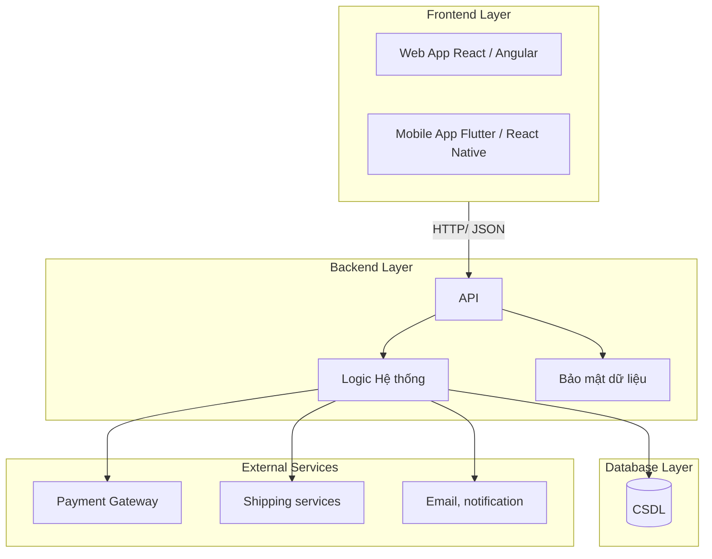

<h1>Ex2: Tổng quan về kiến trúc 3 tầng</h1>

    
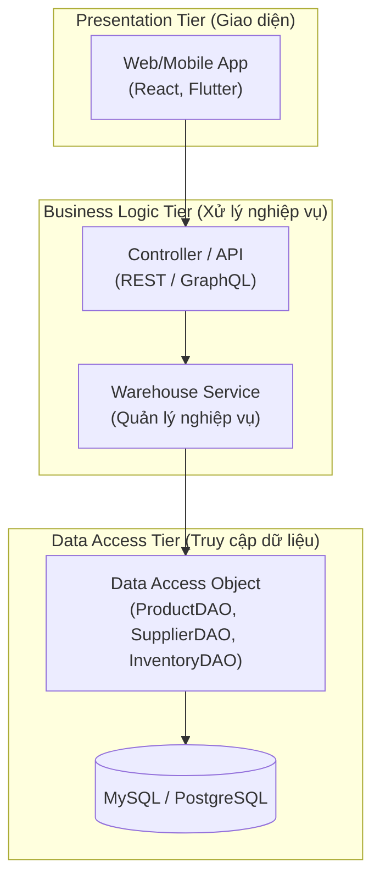
<h3>Phân tầng chi tiết</h3>
<ul>
    <li><strong>Presentation: </strong>Là nơi, người dùng tương tác với hệ thống, hiện thị danh sánh sp, nhà cung , tồn kho ...</li>
    <li><strong>Business Logic: Xử lý logic trung gian, kiểm tra dữ liệu đkien nghiệp vuj, tính toán tồn kho, kết hợp dữ liệu từ Data</strong></li>
    <li><strong>Data Access Tier: </strong>Là tầng giao tiếp trực tiếp với CDSL, thực hiện truy vấn CRUD, cung cấp interface</li>
</ul>

<h1>Ex3 :L sơ đồ package/module của hệ thống đặt vé máy bay.</h1>

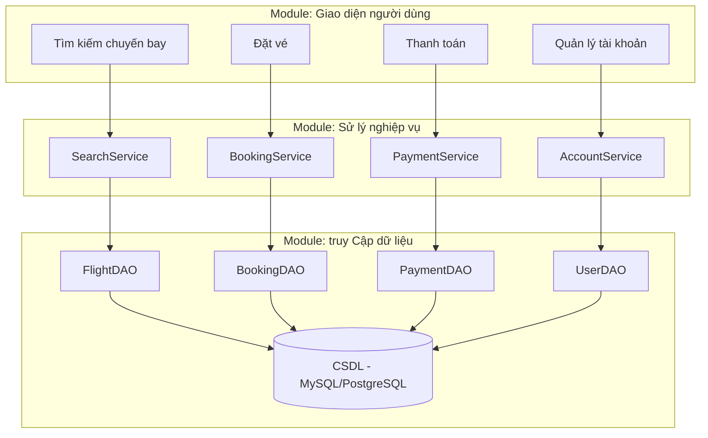

<h1>Ex4: Hệ thống bán hàng online </h1>

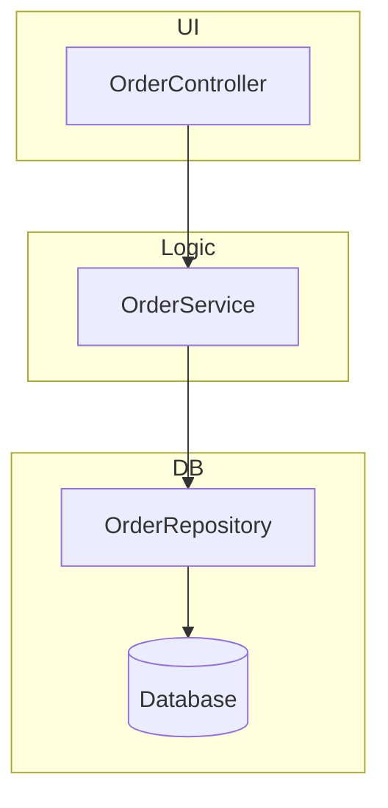
<h3>UML Class Diagram</h3>

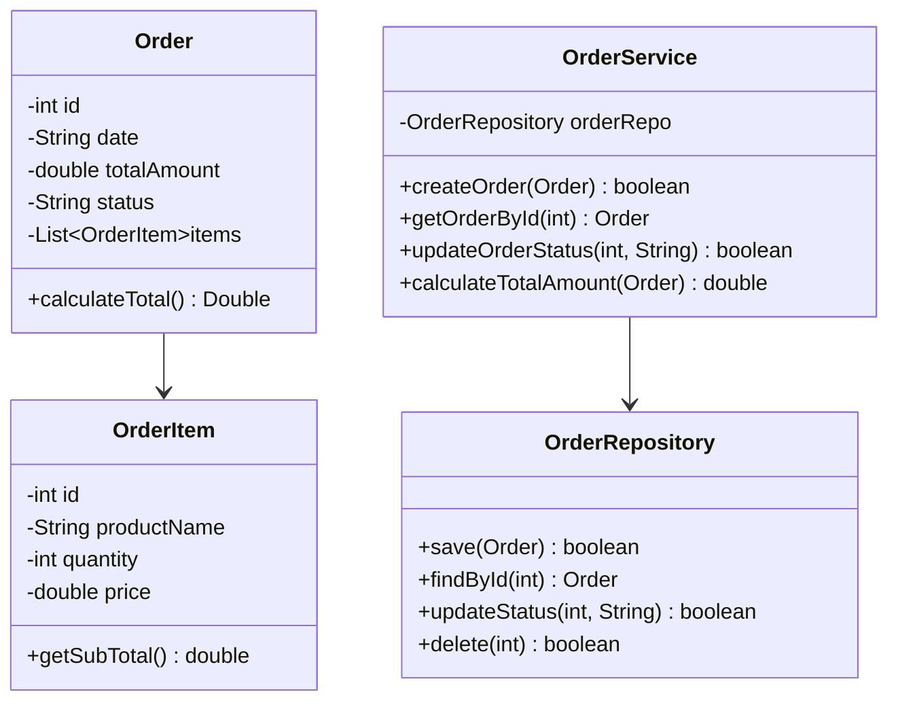

<h1>Ex5: Hệ thống blog cá nhân,</h1>
<h3>1.Presentation: </h3>
<ul>
    <li>PostController: Quản lý yêu cầu tạo, sửa đọc bài viết</li>
    <li>CommentController: xử lý y/c thềm sửa xoá bình luận</li>
    <li>UserController: xử lý đăng nhập, đăng kí, quản lý Tk</li>
    <li><strong>Vai trò</strong>: Nhận request từ client, gọi business layer, trả response HTML JSON ..</li>
</ul>

<h3>2.Business Layer </h3>
<ul>
    <li>PostService: xử lý nghiệp vụ bài viết</li>
    <li>CommentService: sử lý nghiệp vụ bình luận</li>
    <li>UserService: Xác thực đăng nhập, đăng kí..</li>
    <li><strong>Vai trò</strong>: thực hiện quy tác nghiệp vụ, ko có phép xoá bình luận của ngkach gọi data để dọc ghi dữ liệu</li>
</ul>
<h3>Dada Access Layer</h3>
<ul>
    <li>PostRepository: CRUD bài viết</li>
    <li>CommentRepository: CRUD bình luận</li>
    <li>UserRepository: CRUD người dùn, xác thực ĐN</li>
    <li><strong>Vai trò:</strong> Giao tiếp với CSDL, thực thi câu lệnh SQL..</li>
</ul>

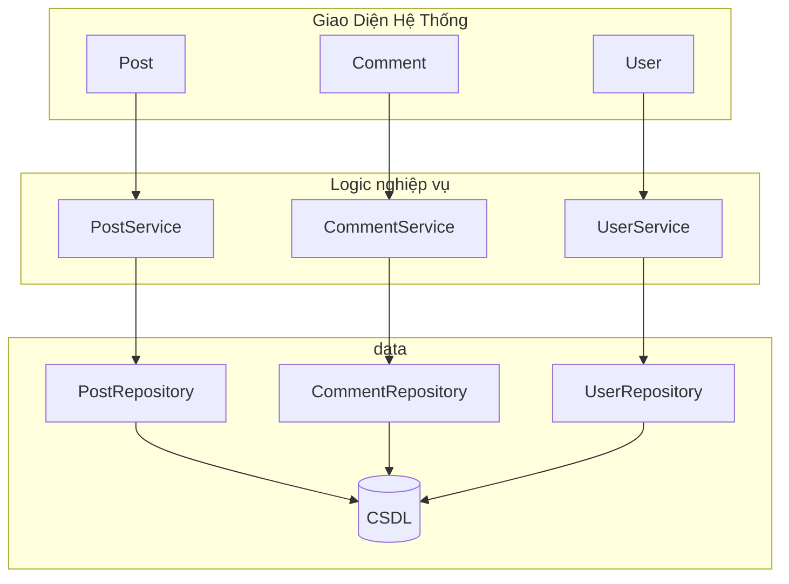

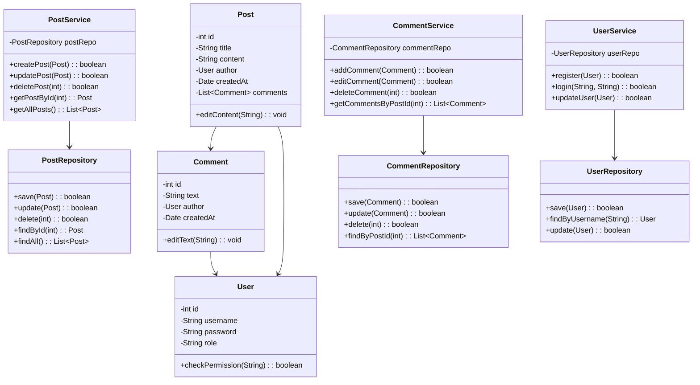

<h1>Ex6: Hệ thống bán lẻ  </h1>

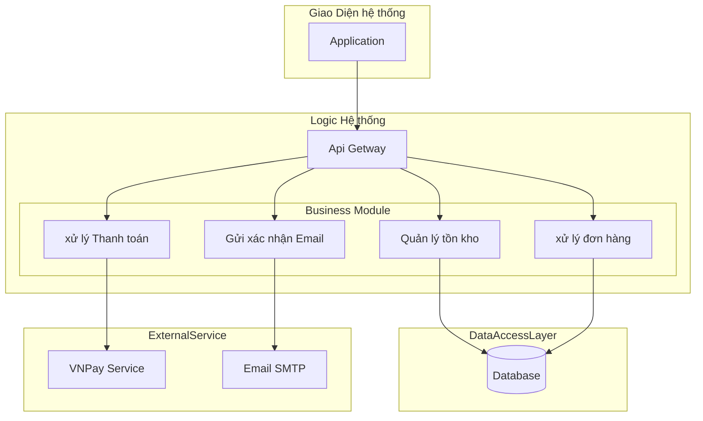

<h1>Ex7: mô tả nghiệp vụ: Một hệ thống học trực tuyến</h1>
<ul>
    <li>Đăng kí tài khoản -> UserManagement -> xử lý tạo tài khoản, lưu thông tin người dùng, xác thục email</li>
    <li>Đăng Nhập -> Authentication -> xử lý xác thực tài khoản, tạo token truy cập, phân quyền người dùng</li>
    <li>Xem Khoá Học -> courseManagement -> quản lý danh sách khoá, hiện thị nội dung và thông tin, chi tiết khoá học</li>
    <li>Làm Bài Quiz -> QuizManagement -> Quản lý câu hỏi, lưu kết quản lý..</li>
    <li>Xem kết quả -> ResultManagement -> hiện thị điểm, lưu diểm, tổng hợp kết quả môn học,..</li>
</ul>

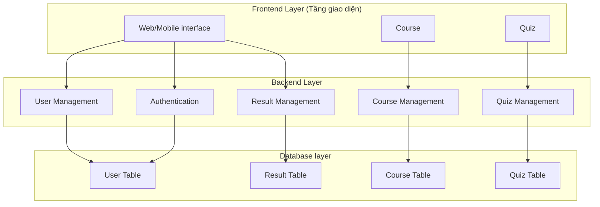

<h1>Ex8: Hệ thống bán hàng online </h1>

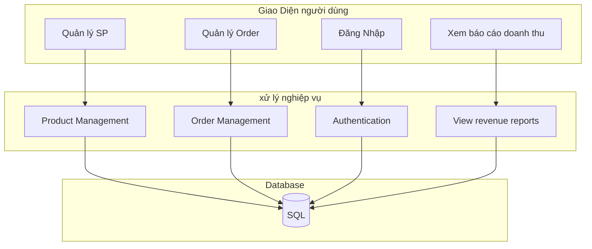

<ul>
     <li>Presentation: Lớp Giao Diện người dùng</li>
     <li>Business Logic Layer: Lớp xử lý logic nhiệp vụ</li>
     <li>DataAccessLayer: lớp data, lưu data hệ thống, User</li>
</ul>

<h1>Ex9: Hệ thống thương mại điện tử </h1>

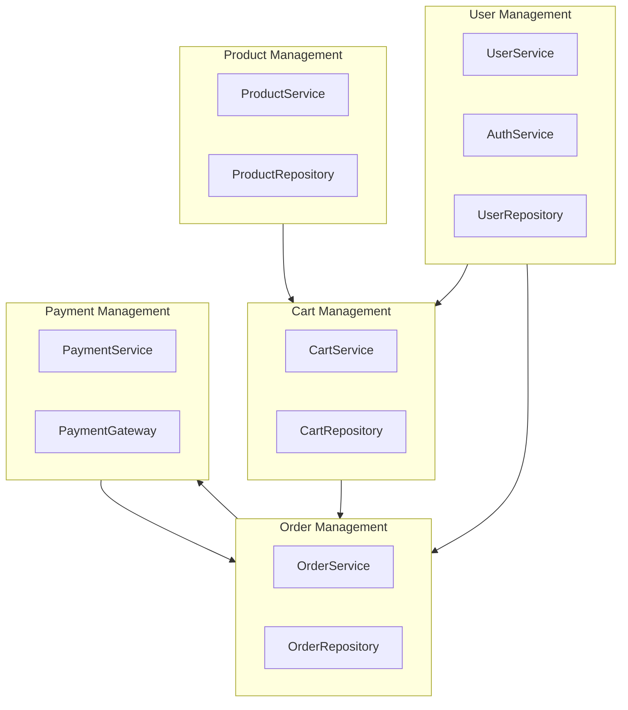

<h3>🔗 3. Quan hệ phụ thuộc (Dependency)</h3>
<ul>
    <li>Order Management → User Management: để lấy thông tin khách hàng.</li>
    <li>Order Management → Product Management: để lấy dữ liệu sản phẩm khi tạo đơn.</li>
    <li>Cart Management → Product Management: để hiển thị thông tin sản phẩm trong giỏ.</li>
    <li>Payment Management → Order Management: để thanh toán cho đơn hàng đã tạo.</li>
    <li>Payment Management → User Management: để xác thực tài khoản người thanh toán.</li>
</ul>

<h3> 4. Lý do phân chia gói</h3>
<ul>
    <li>Tăng khả năng mở rộng (Scalability): Có thể phát triển từng module độc lập.</li>
    <li>Dễ bảo trì (Maintainability): Khi thay đổi logic thanh toán, không ảnh hưởng module khác.</li>
    <li>Tái sử dụng (Reusability): Mỗi package có thể được dùng trong hệ thống tương tự (ví dụ: User Management có thể dùng lại cho hệ thống khác).</li>
    <li>Phân tầng hợp lý (Layer separation): Gắn kết theo chức năng, giảm phụ thuộc chéo.</li>
</ul>

<h1>Ex10: </h1>

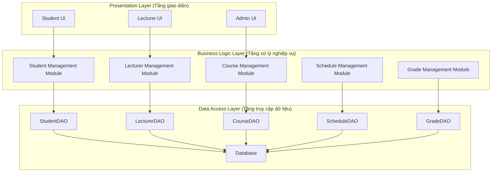

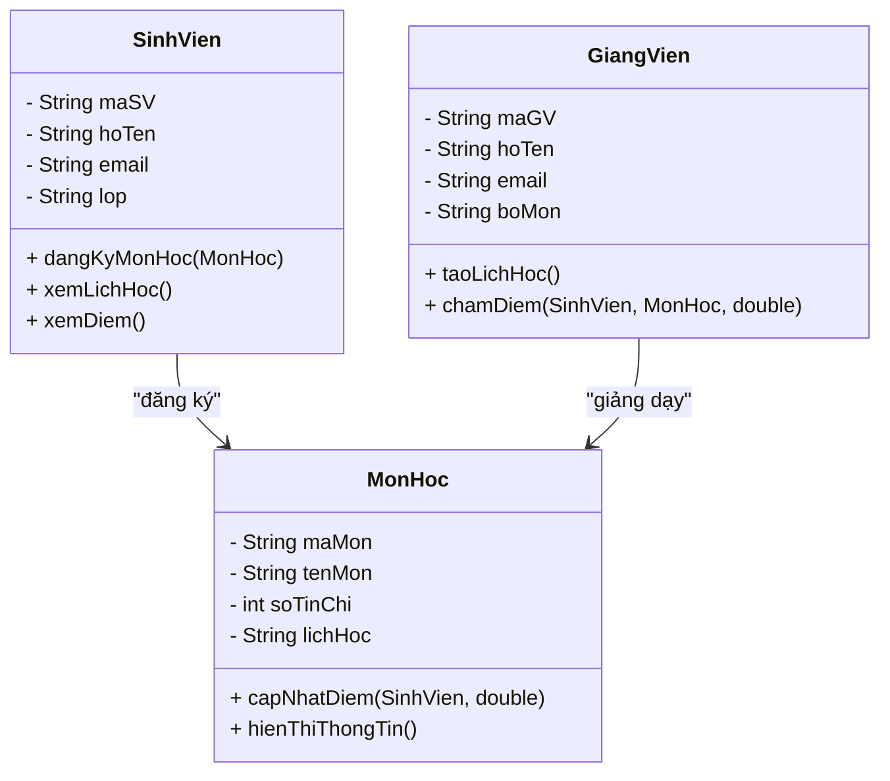

