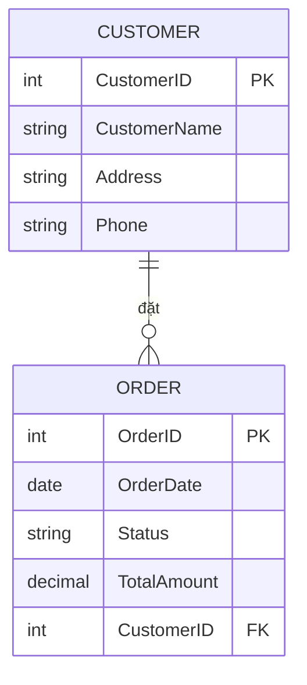
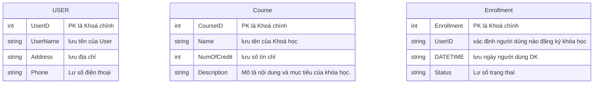
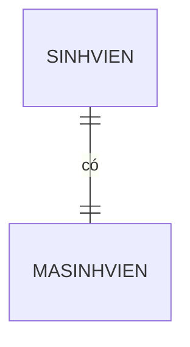
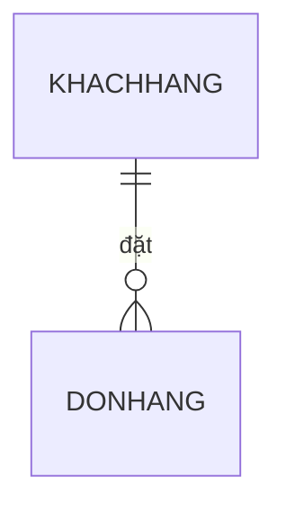
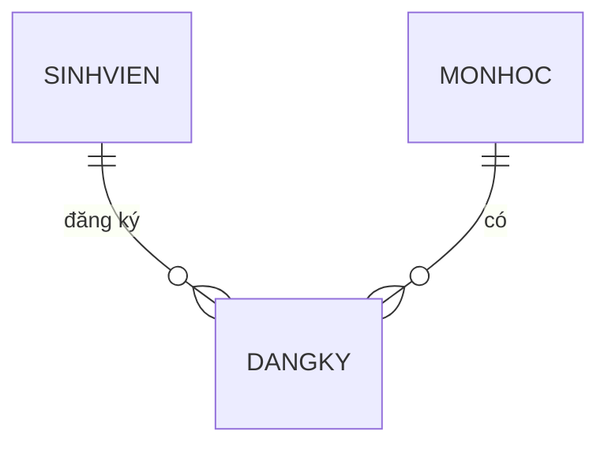
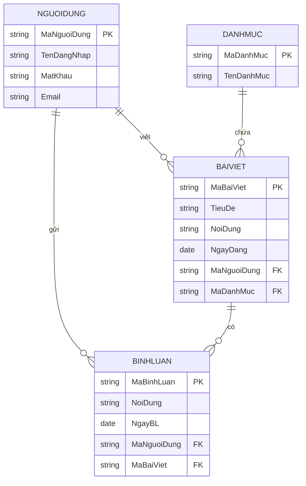
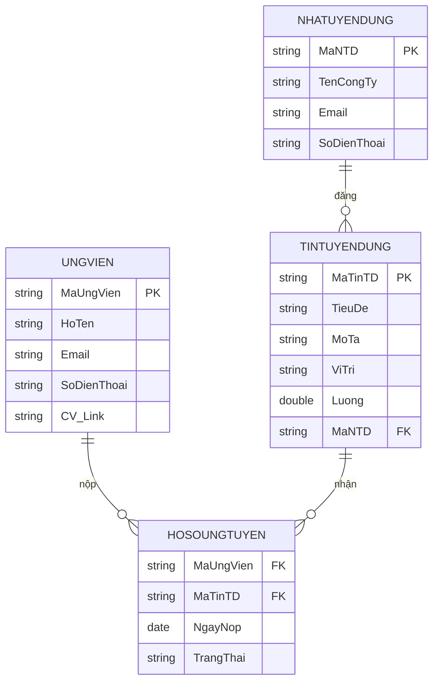

<h1>Xác Định các thực thể chính (Entity)</h1>

<table>
    <tr>
        <th>Entity</th>
        <th>vai trò</th>
        <th>Mối liên kết</th>
    </tr>
    <tr>
        <td>Book</td>
        <td>Chứa thông tin chi tiết, về từng quyển sách, ID, Name, Author ...</td>
        <td>Một quyển sách có thể viết bởi 1 hoặc nhiều tác giả, và có thể có nhiều trong đơn hàng</td>
    </tr>
     <tr>
        <td>Tác Giả</td>
        <td>Lưu Trữ Thông tin ID, Name, YOB, quốc tich ...</td>
        <td>Một tác giả có thể viết nhiều sác quan hệ vs sách 1 - N</td>
    </tr>
     <tr>
        <td>Khác Hàng</td>
        <td>Quản lý thông tin, ID , Name, Address, phoneNumber ....</td>
        <td>Mội Khác hàng có thể tạo nhiều đơn 1 -N </td>
    </tr>
     <tr>
        <td>Đơn Hàng</td>
        <td>thông tin: date, status, totalAmount, IdOrder, IdCus...</td>
        <td>Mội đơn hàng có thể chưa nhiều sản phẩm, và thuộc về 1 khách hàng</td>
    </tr>
     <tr>
        <td>Chi tiết đơn hàng</td>
        <td>Liên kê từng sp trong đơn hàng, bao gồm mã đơn hàng, mã sách, số lượng, đơn giá</td>
        <td>Mỗi đơn gắn với 1 khác hàng và 1 sach ( N -N giũa sách và đơn hàng</td>
    </tr>
</table>

<h1>Ex2:sự khác nhau giữa ERD và Class Diagram.</h1>
<table>
    <tr>
         <th>Tiêu chí</th>
         <th>ERD </th>
         <th>Cass Diagram</th>
    </tr>
    <tr>
         <td>Mục Đính</td>
         <td>Dùng để mô tả cấu trúc dữ liệu trong hệ thống, các thực thể liên kết với nhau trong cơ sở dữ liệu</td>
         <td>Dùng để mô tả cấu trúc và hành vi của hệ thống hướng đối tượng, cách lớp và phương thức tương tác trong chương trình</td>
    </tr>
     <tr>
         <td>Thành phần chính</td>
         <td>Entity - Attribute - Relationship</td>
         <td>Class - Attribute - Method - Association / Inheritance / Aggregation / Composition</td>
    </tr>
     <tr>
         <td>Biểu diễn Mối quan hệ</td>
         <td>Biểu diễn bằng các đường nối giữa các thực thể, kèm số (1 - 1, 1 -N .. )và kiểu quan hệ</td>
         <td>Biểu diễn bằng các đường liên kết, thể hiện kiểu quan hệ đối tượng </td>
    </tr>
     <tr>
         <td>Sử dụng trong giai đoạn nào</td>
         <td>Dùng trong giai đoạn Phân tích dữ liệu, khi thiết kế cơ sở dữ liệu</td>
         <td>Dùng trong giai đoạn thiết kế đối tượng</td>
    </tr>
     <tr>
         <td>VD:</td>
         <td>Trong hệ thống bán sách:  Entity Sách, Tác giả, Khách hàng, Đơn hàng, Chi tiết đơn hàng.  Mối quan hệ: Khách hàng đặt Đơn hàng, Đơn hàng chứa Sách.
 </td>
         <td>Trong hệ thống bán sách:  Class Book, Author, Customer, Order, OrderDetail.  Quan hệ: Order chứa nhiều OrderDetail, Customer kế thừa từ User, Book thuộc về Author.
</td>
    </tr>
</table>

<h1>Ex3: Thực hành vẽ ERD cơ bản với quan hệ.</h1>

<h1>Ex4:</h1>

<H1>EX5: </h1>
<h3>Một sinh viên có một mã sinh vien duy nhất</h3

<h3>Một khách hàng có thể đặt nhiều đơn hàng</h3

<h3>Một Sinh viên có thể học nhiều môn học, và mỗi môn học có thể nhiều sinh viên</h3

<h1>Ex: 6</h1>
<h3>Chuẩn hóa về dạng chuẩn 1NF (First Normal Form)</h3>

<table>
    <tr>
        <th>Mã Đơn</th>
        <th>Tên Khách Hàng</th>
        <th>SĐT</th>
        <th>Tên SP</th>
        <th>Tổng tiền</th>
    </tr>
    <tr>
        <td>HD001</td>
        <td>An</td>
        <td>0912345678</td>
        <td>Bút bi</td>
        <td>50,000</td>
    </tr>
     <tr>
        <td>HD001</td>
        <td>An</td>
        <td>0912345678</td>
        <td>Vở</td>
        <td>50,000</td>
    </tr>
     <tr>
        <td>HD001</td>
        <td>An</td>
        <td>0912345678</td>
        <td>Thước</td>
        <td>50,000</td>
    </tr>
     <tr>
        <td>HD002</td>
        <td>Bình</td>
        <td>0987654321</td>
        <td>Sách</td>
        <td>80,000</td>
    </tr>
     <tr>
        <td>DH002</td>
        <td>Bình</td>
        <td>0987654321</td>
        <td>Bút bi</td>
        <td>80,000</td>
    </tr>
     <tr>
        <td></td>
        <td></td>
        <td></td>
        <td></td>
        <td></td>
    </tr>
</table>
Khóa chính (PK): (Mã hóa đơn, Tên sản phẩm)

<h3>Chuẩn hóa về dạng chuẩn 2NF (Second Normal Form)</h3>
Tách thành 2 bảng:

<table>
    <tr>
        <th>Mã Đơn</th>
        <th>Tên Khách Hàng</th>
        <th>SĐT</th>
        <th>Tồng tiền</th>
    </tr>
    <tr>
        <td>HD001</td>
        <td>An</td>
        <td>0912345678</td>
        <td>50,000</td>
    </tr>
    <tr>
        <td>HD002</td>
        <td>Binh</td>
        <td>0987654321</td>
        <td>80,000</td>
    </tr>
</table>

<h4>Bảng CT_HOADON (Chi tiết hóa đơn)</h4>

<table>
    <tr>
        <th>Mã hoá đơn</th>
        <th>Tên SP</th>
    </tr>
    <tr>
        <td>HD001</td>
        <td>Búi Bi</td>
    </tr>
     <tr>
        <td>DH001</td>
        <td>Vở</td>
    </tr>
     <tr>
        <td>HD001</td>
        <td>Thước</td>
    </tr>
     <tr>
        <td>HD002</td>
        <td>Sách</td>
    </tr>
     <tr>
        <td>DH002</td>
        <td>Bút chì</td>
    </tr>
</table>

<h3>Bước 3: Chuẩn hóa về dạng chuẩn 3NF (Third Normal Form)</h3>
<!-- Bảng KHACHHANG -->
<table>
  <tr>
    <th>Mã KH (PK)</th>
    <th>Tên khách hàng</th>
    <th>Số điện thoại</th>
  </tr>
  <tr>
    <td>KH001</td>
    <td>An</td>
    <td>0912345678</td>
  </tr>
  <tr>
    <td>KH002</td>
    <td>Bình</td>
    <td>0987654321</td>
  </tr>
</table>

 

<!-- Bảng HOADON -->
<table>
  <tr>
    <th>Mã hóa đơn (PK)</th>
    <th>Mã KH (FK)</th>
    <th>Tổng tiền</th>
  </tr>
  <tr>
    <td>HD001</td>
    <td>KH001</td>
    <td>50,000</td>
  </tr>
  <tr>
    <td>HD002</td>
    <td>KH002</td>
    <td>80,000</td>
  </tr>
</table>

 

<!-- Bảng CT_HOADON -->
<table>
  <tr>
    <th>Mã hóa đơn (FK)</th>
    <th>Tên sản phẩm</th>
  </tr>
  <tr>
    <td>HD001</td>
    <td>Bút bi</td>
  </tr>
  <tr>
    <td>HD001</td>
    <td>Vở</td>
  </tr>
  <tr>
    <td>HD001</td>
    <td>Thước</td>
  </tr>
  <tr>
    <td>HD002</td>
    <td>Sách</td>
  </tr>
  <tr>
    <td>HD002</td>
    <td>Bút</td>
  </tr>
</table>

<h1>Ex7</h1>

<h1>Ex8: </h1>

