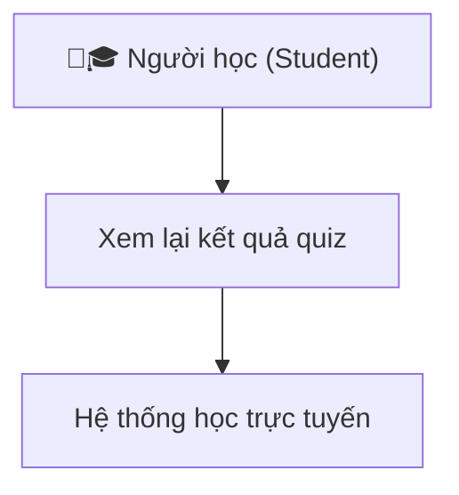

<h1>Ex: 1</h1>

<table>
    <tr>
        <th>Y/c Ban đầu ( mơ hồ )</th>
        <th>Y/c Viết lại</th>
        <th>Giải thích</th>
    </tr>
    <tr>    
        <td>1.Hệ thống cần hoàn thiện với người dùng</td> mà
        <td>Người dùng có thể hoàn thành, thao tác chính (đăng ký or đặt hàng trong vòng 3p mà ko cần hướng dẫn</td>
        <td>"thân thiện", việc quy địng thời gian và tỉ lệ người dùng, thành công, giúp đo lường được mức độ dễ sử dụng</td>
    </tr>
    <tr>    
        <td>2.Trang web phải chạy nhanh</td>
        <td>Thời gian tải trang chính không vượt quá 2s trên kết nối 4G, với dung lượng tải về dưới 2MB</td>
        <td>"Nhanh" được lượng hoá bằng thời gian tải và dung lượng. Có thể kiểm thử bằng công cụ</td>
    </tr>
    <tr>    
        <td>3.Tìm Kiếm cần phải tiện lợi</td>
        <td>Kết quả tìm kiếm phải hiện thị, trong vòng 1s và hiện thị ít nhất 5 kết quả, phù hợp đầu tiên</td>
        <td>“Tiện lợi” được chuyển thành tiêu chí đo tốc độ và độ chính xác, có thể kiểm tra tự động.</td>
    </tr>
    <tr>    
        <td>4.Ứng dụng phải bảo mật tốt</td>
        <td>Mọi dữ liệu người dùng được truyền qua HTTPS, MK đc nã hoá bằng thuật toán, bcryot, với độ phức tạp cao</td>
        <td>“Bảo mật tốt” được cụ thể hóa bằng các tiêu chuẩn kỹ thuật bảo mật phổ biến, giúp dễ dàng kiểm thử và đánh giá.</td>
    </tr>
    <tr>    
        <td>5.Giao diện đẹp và dẽ nhìn</td>
        <td>Màu sắc tuân theo quy chuẩn tương pảhn tối thiểu, bố cuc hiện thị tối</td>
        <td>Dễ nhìn , tiêu chuẩn, và khả năng, hiện thị.</td>
    </tr>
    <tr>    
        <td>6.Hệ thống cần có tính linh hoạt cao.</td>
        <td>Hệ thống cho phép cấu hình tối thiểu 3 tham số chính (ngôn ngữ, đơn vị tiền tệ, timezone) mà không cần sửa mã nguồn.</td>
        <td>“Linh hoạt” trở thành khả năng cấu hình được xác định rõ và có thể kiểm thử bằng việc thay đổi tham số.</td>
    </tr>
    <tr>    
        <td>7.Người dùng cảm thấy hài lòng khi sử dụng.</td>
        <td>Đạt điểm TB > 4/5 trong khảo sát đánh giá trải nghiệm sau khi sử dun</td>
        <td>“Hài lòng” được lượng hóa bằng khảo sát định lượng, có thể đo và thống kê.</td>
    </tr>
    <tr>    
        <td>8.Ứng dụng cần hoạt động ổn định.</td>
        <td>Tỷ lệ uptime ≥ 99.5% trong 30 ngày; không xảy ra crash quá 1 lần/tuần trong môi trường sản xuất.</td>
        <td>“Ổn định” được chuyển thành tiêu chí uptime và crash rate, có thể kiểm thử bằng giám sát hệ thống.</td>
    </tr>
    
</table>

<h1>Ex2</h1>
<link>https://www.figma.com/design/vkxFHmmW4JYwNqZesPVWON/Untitled?node-id=0-1&t=briHqB41ysoQhBDa-1


<h1>Ex2:</h1>
<table>
    <tr>
        <th>Mô tả Y/c</th>
        <th>Thuộc phần nào trong SRS</th>
        <th>Giải thích</th>
    </tr>
    <tr>
        <td>Hệ thống hỗ trợ 5000 user online</td>
        <td>Performance Requirement</td>
        <td>Đây là y/c về hiệu năng của hệ thống -mô tả khả năng chịu tải, cụ thệ là hệ thống, cần dảm bảo, hoạt động ổn định, có tối đa 5000 người dùng truy cập</td> 
    </tr>
     <tr>
        <td>Người dùng đc phép xem lịch sử Giao Dịch</td>
        <td>Function Requirements</td>
        <td>Đây là 1 chức năng, cụ thể trong hệ thống, cho phép người dùng thao tác, thực hiện hành động "xem lịch sử". nó mô tả hàng vi, mà hệ thống phải cung cấp, để đáp ứng nhu cầu..</td> 
    </tr>
     <tr>
        <td>Chức năng này cần bảo mật cấp cao</td>
        <td>Security Requirement</td>
        <td>Câu này đề cập rõ đến Y/c bảo mật. Nó mô tả độ an toàn cần  đat, bao gồm việc hạn chế quyền truy cập, mã hoá dữ liệu hoặc Y/c xác thực nghiêm ngắt, thuộc nhóm non-function requirement, cụ thể Security Requirement</td> 
    </tr>
</table>


<h1>E4:</h1>

<table>
    <tr>
        <th>Mục</th>
        <th>Nội dung</th>
    </tr>
    <tr>
        <td>Tên Use Case</td>
        <td>Đăng kí tài khoản</td>
    </tr>
    <tr>
        <td>Actor</td>
        <td>Người dùng mới</td>
    </tr>
    <tr>
        <td>Mục tiêu</td>
        <td>Cho phép người dùng tạo một tài khoản, để truy cập và sử dụng hệ thôgns</td>
    </tr>
    <tr>
        <td>ĐK trước</td>
        <td>Người dùng chưa có tk, trên hệ thống</td>
    </tr>
    <tr>
        <td></td>
        <td></td>
    </tr>
    <tr>
        <td>Luồng chính</td>
        <td>1.Người dùng, truy cập trang ĐK, 2. Hệ thống hiện form bao hồm: email, tên, MK, Xác Nhận MK.. 3.Người dùng điền đẩy dủ thông tin, 4.hệ thống Ktra phù hợp, 5.Hệ thống thông báo và chuyển hướng</td>
    </tr>
    <tr>
        <td>Ngoai lệ</td>
        <td>1. Email đã tồn tại, 2. MK và XNMK ko khớp, 3.Kết nối máy chủ thất bại</td>
    </tr>
    <tr>
        <td>Đk Sau</td>
        <td>Thông tin người dùng đã đc lưu trong CDSL</td>
    </tr>
     <tr>
        <td>Tuỳ chọn</td>
        <td>Có thể thêm bước xác minh, gửi liên kết đến hộp thư người dùng</td>
    </tr>
</table>

<h1>Ex5:</h1>
<table>
    <tr>
         <th>TestID</th>
         <th>Mô tả Test</th>
         <th>input</th>
         <th>Kỳ vọng</th>
         <th>Kết Qủa</th>
    </tr>
    <tr>
        <td>TC_001</td>
        <td>Thay đổi mật khẩu thành công</td>
        <td>1.Đăng nhập vào hệ thống.<br>
            2.Truy cập trang “Thay đổi mật khẩu”.<br>
            3.Nhập mật khẩu cũ hợp lệ.<br>
            4.Nhập mật khẩu mới hợp lệ (≥8 ký tự, gồm chữ và số).<br>
            5.Xác nhận mật khẩu mới trùng khớp.<br>
            6.Nhấn “Xác nhận”.</td>
        <td>Hệ thống hiển thị thông báo “Thay đổi mật khẩu thành công”. Người dùng có thể đăng nhập lại bằng mật khẩu mới.
</td>
        <td>Hệ thống thông báo thành công và MK mới đc lưu lại Vào CDSL</td>
    </tr>
    <tr>
        <td>TC_002</td>
        <td>Thay dổi Mật Khẩu thất bại>
        <td>1. Đăng Nhập và hệ thống. <br>
            2.Truy cập trang “Thay đổi mật khẩu”.<br> 
            3.Nhập mật khẩu Không Hợp lệ.<br>
            4.Nhập mật khẩu mới hợp lệ (≥8 ký tự, gồm chữ và số).<br>
            5.Xác nhận mật khẩu mới trùng khớp.<br>
            6.Nhấn “Xác nhận”.</td>
        <td>Hệ thống hiển thị thông báo “invalid case”. Mật Khẩu mới không được lưu vào hệ thống.</td>
        <td>Hệ thông đã thông báo báo  “invalid case” và không lưu đc mật khẩu mới </td>
    </tr>
    <tr>
        <td>TC_003</td>
        <td>xác nhận mật khẩu không khớp hoặc để trống</td>
        <td>1. Đăng Nhập và hệ thống. <br>
            2.Truy cập trang “Thay đổi mật khẩu”.<br> 
            3.Nhập mật khẩu Không Hợp lệ.<br>
            4.Nhập mật khẩu mới hợp lệ (≥8 ký tự, gồm chữ và số).<br>
            5.Xác nhận mật khẩu mới Không trùng khớp.<br>
            6.Nhấn “Xác nhận”</td>
        <td>Thông Báo MK không trùng khớp, thông báo ko lưu đc mật khẩu mới</td>
        <td>Hệ thống báo hiện thỉ, Mk không trùng khớp, ko lưu đc Mk</td>
    </tr>

</table>

<h1>Ex6</h1>
<table>
    <tr>
        <th>1. Tiêu chí</th>
        <th>Nội Dung</th>
    </tr>
     <tr>
        <td>1. Điểm Chưa rõ trong Y/c</td>
        <td>- “Trải nghiệm tốt” là cụm từ mơ hồ, không xác định rõ tiêu chí nào cấu thành “tốt” (ví dụ: tốc độ, độ chính xác, giao diện, mức độ hài lòng…).- Không chỉ rõ người dùng nào (tất cả người dùng hay nhóm cụ thể).- Không nói rõ trang tìm kiếm áp dụng cho loại dữ liệu gì (sản phẩm, bài viết, khóa học…).
</td>
    </tr>
    <tr>
        <td>2. Vì sao chưa đạt chuẩn SRC</td>
        <td>Theo chuẩn IEEE 830 SRS, yêu cầu cần: rõ ràng, có thể đo lường, kiểm thử được, và không gây hiểu lầm. Câu này vi phạm các tiêu chí: • Không rõ ràng (vague).• Không định lượng (unmeasurable).• Không thể kiểm thử (untestable).• Không xác định điều kiện hoặc hành động cụ thể của hệ thống.
</td>
    </tr>
    <tr>
        <td>3. Cách viết rõ ràng</td>
        <td>Phiên bản cải tiến:  “Hệ thống trang tìm kiếm phải hiển thị kết quả trong ≤ 2 giây đối với truy vấn thông thường và phải đạt độ chính xác ≥ 90% so với tập dữ liệu kiểm thử.” Hoặc nếu nhấn mạnh trải nghiệm người dùng:  “Tối thiểu 85% người dùng thử nghiệm đánh giá trang tìm kiếm ở mức ‘Hài lòng’ trở lên trong khảo sát trải nghiệm.”
</td>
    </tr>
    <tr>
        <td>4. Có thể kiểm thử NTN</td>
        <td>Kiểm thử hiệu năng (Performance Test): đo thời gian phản hồi trung bình của trang tìm kiếm trên 100 truy vấn ngẫu nhiên.- Kiểm thử độ chính xác (Precision/Recall Test): so sánh kết quả trả về với tập dữ liệu chuẩn. - Khảo sát người dùng (User Experience Survey): thu thập phản hồi của ≥ 30 người dùng thật qua bảng câu hỏi Likert 5 mức độ.
</td>
    </tr>
</table>


<h1>Ex7: </h1>
<h2>Hệ thống E-learning system</h2>

<ul>
    <li>Thời gian tải trang học (Lesson Page) không vượt quá 3 giây với 1000 người dùng truy cập đồng thời
</li>
    <li>Hệ thống phải duy trì thời gian hoạt động (uptime) ≥ 99.5% mỗi tháng, ngoại trừ thời gian bảo trì đã thông báo trước.
</li>
    <li>Dữ liệu bài giảng và điểm số của sinh viên phải được mã hóa bằng AES-256 khi lưu trữ và khi truyền qua mạng.
</li>
</ul>


<h2>2. Hệ thống bán hàng thương mại điện tử (E-Commerce System)</h2>

<ul>
    <li>Trang thanh toán phải xử lý 1000 giao dịch/giây mà không làm mất dữ liệu đơn hàng.
</li>
    <li>Hệ thống phải hỗ trợ tăng số lượng sản phẩm lên gấp 5 lần hiện tại mà không cần thay đổi kiến trúc hoặc downtime.
</li>
    <li>Mỗi phiên đăng nhập người dùng sẽ tự động hết hạn sau 15 phút không hoạt động, và yêu cầu xác thực lại khi truy cập chức năng thanh toán.
</li>
</ul>


<h1>Ex8: </h1>
<table>
  <thead>
    <tr>
      <th>Mã yêu cầu</th>
      <th>Mô tả yêu cầu phi chức năng</th>
      <th>Thuộc loại</th>
      <th>Cách kiểm thử</th>
    </tr>
  </thead>
  <tbody>
    <tr>
      <td>NFR-S1</td>
      <td>Trang thanh toán phải xử lý 1000 giao dịch/giây mà không làm mất dữ liệu đơn hàng.</td>
      <td>Hiệu năng (Performance)</td>
      <td>Dùng stress test kiểm tra throughput và dữ liệu sau khi test.</td>
    </tr>
    <tr>
      <td>NFR-S2</td>
      <td>Hệ thống phải hỗ trợ tăng số lượng sản phẩm lên gấp 5 lần hiện tại mà không cần thay đổi kiến trúc hoặc downtime.</td>
      <td>Khả năng mở rộng (Scalability)</td>
      <td>Kiểm thử bằng cách nạp thêm dữ liệu sản phẩm và theo dõi tốc độ phản hồi.</td>
    </tr>
    <tr>
      <td>NFR-S3</td>
      <td>Mỗi phiên đăng nhập người dùng sẽ tự động hết hạn sau 15 phút không hoạt động, và yêu cầu xác thực lại khi truy cập chức năng thanh toán.</td>
      <td>Bảo mật (Security)</td>
      <td>Kiểm thử hành vi session timeout: đăng nhập, chờ 15 phút, truy cập lại chức năng thanh toán — hệ thống phải yêu cầu đăng nhập lại.</td>
    </tr>
  </tbody>
</table>




<h1>Ex9:</h1>
<!-- Bảng yêu cầu chức năng -->
<table border="1">
  <thead>
    <tr>
      <th>Mã</th>
      <th>Mô tả yêu cầu chức năng</th>
    </tr>
  </thead>
  <tbody>
    <tr>
      <td>FR-01</td>
      <td>Hệ thống cho phép người học chọn và bắt đầu một bài quiz từ danh sách.</td>
    </tr>
    <tr>
      <td>FR-02</td>
      <td>Hệ thống hiển thị từng câu hỏi kèm các phương án lựa chọn (A, B, C, D).</td>
    </tr>
    <tr>
      <td>FR-03</td>
      <td>Hệ thống cho phép chọn một hoặc nhiều đáp án tùy loại câu hỏi (single/multiple choice).</td>
    </tr>
    <tr>
      <td>FR-04</td>
      <td>Hệ thống hiển thị đồng hồ đếm ngược thời gian làm bài.</td>
    </tr>
    <tr>
      <td>FR-05</td>
      <td>Hệ thống tự động lưu lựa chọn sau mỗi câu (auto-save).</td>
    </tr>
    <tr>
      <td>FR-06</td>
      <td>Hệ thống cho phép di chuyển giữa các câu hỏi (Next/Previous).</td>
    </tr>
    <tr>
      <td>FR-07</td>
      <td>Khi hết thời gian, hệ thống tự động nộp bài và tính điểm.</td>
    </tr>
    <tr>
      <td>FR-08</td>
      <td>Sau khi nộp, hệ thống hiển thị điểm tổng, đáp án đúng, và đáp án đã chọn.</td>
    </tr>
    <tr>
      <td>FR-09</td>
      <td>Hệ thống lưu kết quả làm bài vào cơ sở dữ liệu với thời gian hoàn thành.</td>
    </tr>
  </tbody>
</table>

<br>

<!-- Bảng yêu cầu phi chức năng -->
<table border="1">
  <thead>
    <tr>
      <th>Mã</th>
      <th>Mô tả yêu cầu phi chức năng</th>
      <th>Loại</th>
    </tr>
  </thead>
  <tbody>
    <tr>
      <td>NFR-01</td>
      <td>Thời gian tải trang quiz không vượt quá 2 giây khi có tối đa 1000 người dùng đồng thời.</td>
      <td>Hiệu năng (Performance)</td>
    </tr>
    <tr>
      <td>NFR-02</td>
      <td>Kết nối và dữ liệu câu trả lời phải được mã hóa bằng giao thức HTTPS và AES-256 để bảo mật.</td>
      <td>Bảo mật (Security)</td>
    </tr>
    <tr>
      <td>NFR-03</td>
      <td>Hệ thống phải có khả năng mở rộng để hỗ trợ tăng gấp đôi số lượng quiz và người dùng mà không cần thay đổi kiến trúc.</td>
      <td>Khả năng mở rộng (Scalability)</td>
    </tr>
    <tr>
      <td>NFR-04</td>
      <td>Giao diện phải phản hồi nhanh, dễ sử dụng, đạt ≥ 4/5 điểm trong khảo sát trải nghiệm người dùng.</td>
      <td>Trải nghiệm người dùng (Usability)</td>
    </tr>
  </tbody>
</table>
```plaintext
------------------------------------------------------------
| [Tên Quiz]                         ⏱️ 10:45 remaining    |
------------------------------------------------------------
| Câu 3/10: HTML là viết tắt của gì?                       |
|  ☐ A. HyperText Markup Language                          |
|  ☐ B. HighText Machine Learning                          |
|  ☐ C. Home Tool Markup Language                          |
|  ☐ D. Hyperlinks and Text Mark Language                  |
------------------------------------------------------------
| [Previous]                    [Next]             [Submit] |
------------------------------------------------------------
| 1 🟩 | 2 ⬜ | 3 🟩 | 4 ⬜ | ... | 10 ⬜                      |
------------------------------------------------------------
```


<h1>Ex10:</h1>

<h2>(1) Mục tiêu hệ thống</h2>
<p><strong>Tên chức năng:</strong> Quản lý khóa học cho giảng viên</p>
<p><strong>Mục tiêu:</strong> Cho phép giảng viên tạo mới, chỉnh sửa, xem và xóa các khóa học mà họ phụ trách, giúp quản lý môn học hiệu quả và đồng bộ với hệ thống e-learning.</p>
<p><strong>Người dùng chính:</strong> Giảng viên (Instructor)</p>
<p><strong>Lợi ích:</strong> Giảm thao tác thủ công, đảm bảo thông tin khóa học chính xác, hỗ trợ các chức năng khác như quản lý sinh viên, bài tập, quiz, điểm số.</p>

<hr />

<h2>(2) Use Case chính – Quản lý khóa học</h2>
<table border="1">
  <tr>
    <th>Thành phần</th>
    <th>Nội dung</th>
  </tr>
  <tr>
    <td>Tên Use Case</td>
    <td>Quản lý khóa học</td>
  </tr>
  <tr>
    <td>Mô tả</td>
    <td>Cho phép giảng viên thêm mới, chỉnh sửa, xóa và xem danh sách các khóa học mà họ phụ trách.</td>
  </tr>
  <tr>
    <td>Actor</td>
    <td>Giảng viên (Instructor)</td>
  </tr>
  <tr>
    <td>Tiền điều kiện</td>
    <td>
      - Giảng viên đã đăng nhập vào hệ thống.<br />
      - Có quyền truy cập trang quản lý khóa học.
    </td>
  </tr>
  <tr>
    <td>Hậu điều kiện</td>
    <td>
      - Dữ liệu khóa học được cập nhật vào cơ sở dữ liệu.<br />
      - Danh sách khóa học hiển thị đúng sau khi thêm / sửa / xóa.
    </td>
  </tr>
  <tr>
    <td>Luồng chính (Main Flow)</td>
    <td>
      1. Giảng viên đăng nhập vào hệ thống.<br />
      2. Chọn menu “Quản lý khóa học”.<br />
      3. Hệ thống hiển thị danh sách khóa học hiện tại.<br />
      4. Giảng viên chọn nút “Thêm mới khóa học”.<br />
      5. Nhập thông tin khóa học (tên, mô tả, số tín chỉ, học kỳ, thời gian).<br />
      6. Nhấn “Lưu”, hệ thống kiểm tra hợp lệ và lưu vào CSDL.<br />
      7. Danh sách khóa học được cập nhật và hiển thị khóa học mới.
    </td>
  </tr>
  <tr>
    <td>Luồng phụ (Alternative Flow)</td>
    <td>
      - Giảng viên sử dụng ô tìm kiếm để lọc khóa học theo tên hoặc học kỳ.<br />
      - Giảng viên có thể xuất danh sách khóa học ra file (ví dụ: Excel).
    </td>
  </tr>
  <tr>
    <td>Ngoại lệ (Exception Flow)</td>
    <td>
      - Lỗi kết nối CSDL: hiển thị “Không thể tải danh sách khóa học, vui lòng thử lại sau”.<br />
      - Thiếu trường bắt buộc: hiển thị “Vui lòng nhập đầy đủ thông tin bắt buộc”.<br />
      - Xóa khóa học đang có sinh viên đăng ký: hiển thị cảnh báo và không cho phép xóa.
    </td>
  </tr>
</table>

<hr />

<h2>(3) UI mô tả – Màn hình “Quản lý khóa học”</h2>
```plaintext
------------------------------------------------------------
|  Quản lý khóa học                                       |
------------------------------------------------------------
| Tìm kiếm: [____________________] [Tìm kiếm] [Thêm mới]  |
------------------------------------------------------------
| ID  | Tên khóa học           | Học kỳ  | Tín chỉ | Hành động |
|-----|------------------------|---------|---------|-----------|
| 001 | Lập trình C cơ bản     | 1/2025  |   3     | [Sửa] [Xóa] |
| 002 | Cấu trúc dữ liệu       | 1/2025  |   4     | [Sửa] [Xóa] |
| 003 | Cơ sở dữ liệu nâng cao | 2/2025  |   3     | [Sửa] [Xóa] |
------------------------------------------------------------
| [⬅ Trang trước]        Trang 1/3        [Trang sau ➡]   |
```
<p><strong>Thành phần UI chính:</strong> ô tìm kiếm, nút “Tìm kiếm”, nút “Thêm mới”, bảng danh sách khóa học, nút “Sửa”, nút “Xóa”, thanh phân trang, popup thêm/sửa khóa học với các ô nhập liệu và nút [Lưu]/[Hủy].</p>

<hr />

<h2>(4) Dữ liệu liên quan</h2>

<h3>Bảng Courses</h3>
<table border="1">
  <tr>
    <th>Thuộc tính</th>
    <th>Kiểu dữ liệu</th>
    <th>Ghi chú</th>
  </tr>
  <tr>
    <td>course_id</td>
    <td>INT</td>
    <td>PK, tự tăng</td>
  </tr>
  <tr>
    <td>course_name</td>
    <td>VARCHAR(255)</td>
    <td>Tên khóa học</td>
  </tr>
  <tr>
    <td>description</td>
    <td>TEXT</td>
    <td>Mô tả khóa học</td>
  </tr>
  <tr>
    <td>semester</td>
    <td>VARCHAR(10)</td>
    <td>Ví dụ: "1/2025"</td>
  </tr>
  <tr>
    <td>credit</td>
    <td>INT</td>
    <td>Số tín chỉ</td>
  </tr>
  <tr>
    <td>teacher_id</td>
    <td>INT</td>
    <td>FK → Teachers.teacher_id</td>
  </tr>
  <tr>
    <td>start_date</td>
    <td>DATE</td>
    <td>Ngày bắt đầu</td>
  </tr>
  <tr>
    <td>end_date</td>
    <td>DATE</td>
    <td>Ngày kết thúc</td>
  </tr>
  <tr>
    <td>created_at</td>
    <td>DATETIME</td>
    <td>Thời gian tạo</td>
  </tr>
  <tr>
    <td>updated_at</td>
    <td>DATETIME</td>
    <td>Thời gian cập nhật</td>
  </tr>
</table>

<h3>Bảng Teachers</h3>
<table border="1">
  <tr>
    <th>Thuộc tính</th>
    <th>Kiểu dữ liệu</th>
    <th>Ghi chú</th>
  </tr>
  <tr>
    <td>teacher_id</td>
    <td>INT</td>
    <td>PK</td>
  </tr>
  <tr>
    <td>full_name</td>
    <td>VARCHAR(100)</td>
    <td>Tên giảng viên</td>
  </tr>
  <tr>
    <td>email</td>
    <td>VARCHAR(100)</td>
    <td>Dùng để đăng nhập</td>
  </tr>
  <tr>
    <td>department</td>
    <td>VARCHAR(100)</td>
    <td>Bộ môn / khoa</td>
  </tr>
</table>

<hr />

<h2>(5) Yêu cầu phi chức năng</h2>
<table border="1">
  <tr>
    <th>Mã</th>
    <th>Yêu cầu phi chức năng</th>
    <th>Cách kiểm thử</th>
  </tr>
  <tr>
    <td>NFR-01</td>
    <td>Thời gian tải danh sách khóa học không vượt quá 2 giây khi có tối đa 500 giảng viên truy cập đồng thời.</td>
    <td>Dùng công cụ kiểm thử tải (k6, JMeter) mô phỏng 500 user và đo thời gian phản hồi trung bình.</td>
  </tr>
  <tr>
    <td>NFR-02</td>
    <td>Dữ liệu giảng viên và khóa học phải được mã hóa bằng HTTPS và AES-256 khi lưu trữ và truyền qua mạng.</td>
    <td>Kiểm tra cấu hình HTTPS, kiểm thử bảo mật bằng công cụ sniffing để xác minh không có dữ liệu plaintext.</td>
  </tr>
  <tr>
    <td>NFR-03</td>
    <td>Giao diện phải hiển thị đúng và không vỡ layout trên PC, tablet và mobile.</td>
    <td>Kiểm thử giao diện trên nhiều độ phân giải màn hình (desktop, tablet, smartphone) và ghi nhận kết quả.</td>
  </tr>
</table>